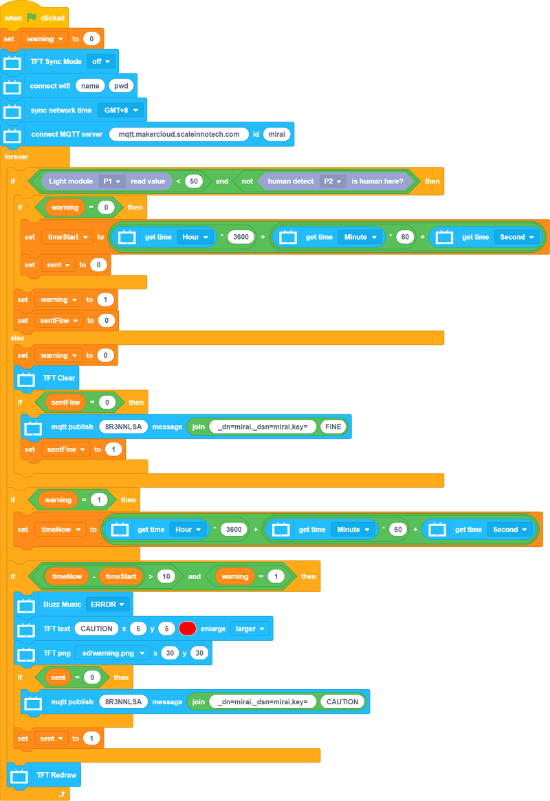

# 平安浴缸

假如偵測到用家在浴缸中昏迷就會透過IoT平台警告家人。

## 搭建說明書

[下載搭建說明書(右擊，另存為)](../images/bath.pdf)

## 參考接線

## 參考程式

### Micro:bit

[參考程式](https://makecode.microbit.org/_ChLPTHW9uiUh)

### 未來板

[參考程式(右擊，另存為)](./smartBathtub.sb3)

[參考圖檔下載(右擊，另存為)](./bathpic.rar)

## 示範短片

[示範短片](https://www.youtube.com/watch?v=tRQiIUIZCpo&t=1s)