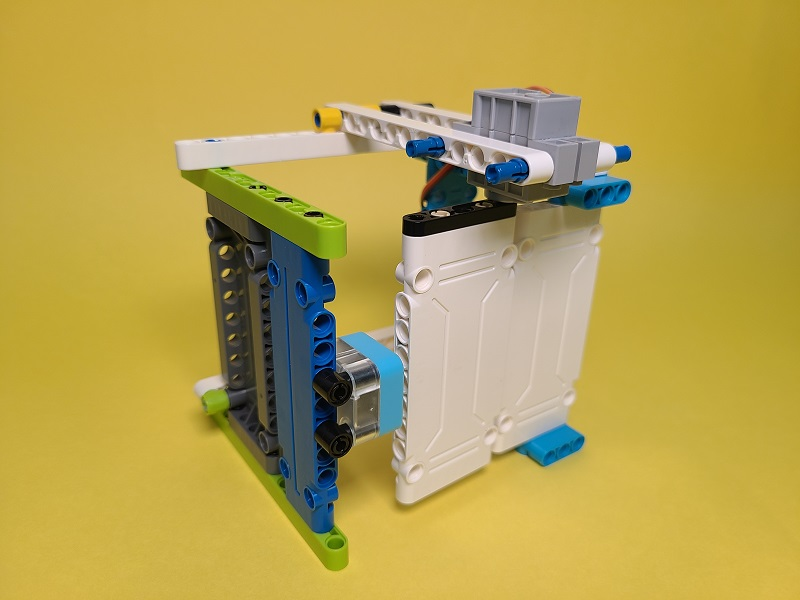
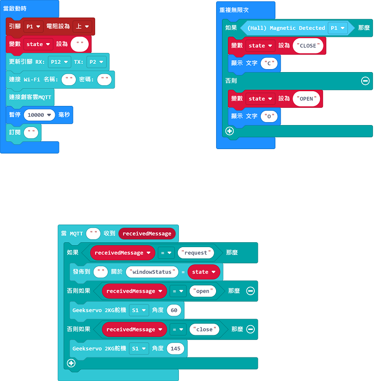
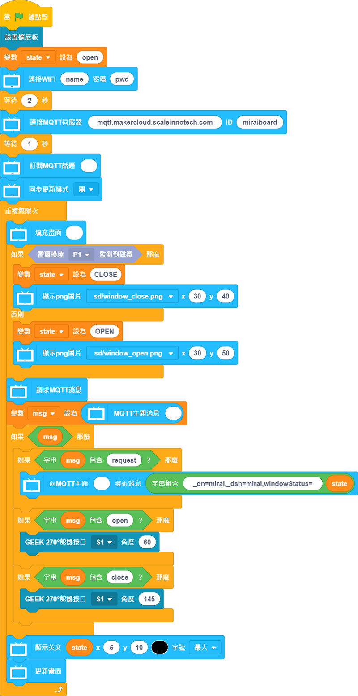

# 搖控窗戶

透過IoT平台控制門窗的開啟或關閉。

## 搭建說明書

[下載搭建說明書資源包]()

## 參考接線

## 參考程式

### Micro:bit

[參考程式](https://makecode.microbit.org/_RwAY9rfbuMhc)

### 未來板

[參考程式資源包]()

## 示範短片

[示範短片](https://www.youtube.com/watch?v=nLj0LCgN1Uk)
