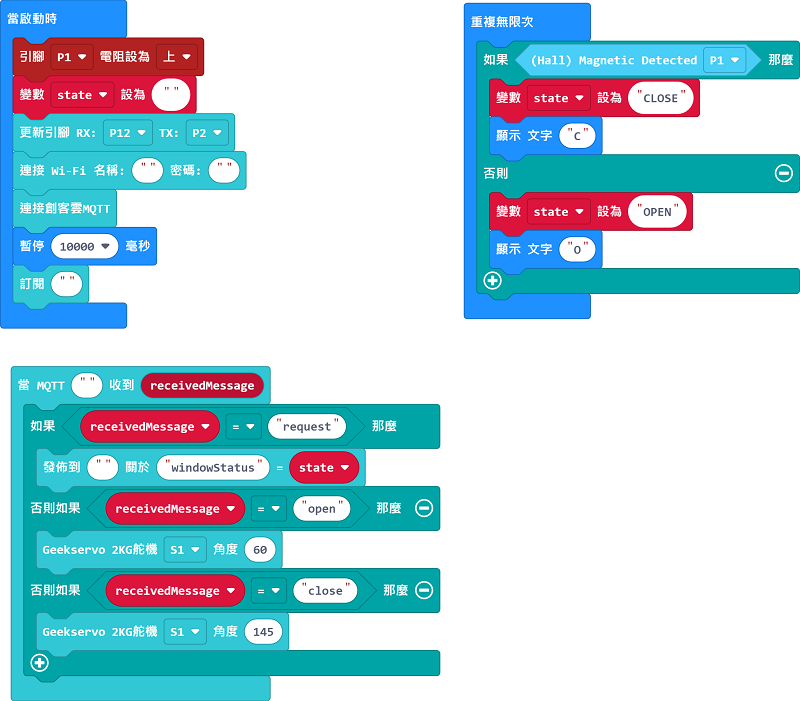
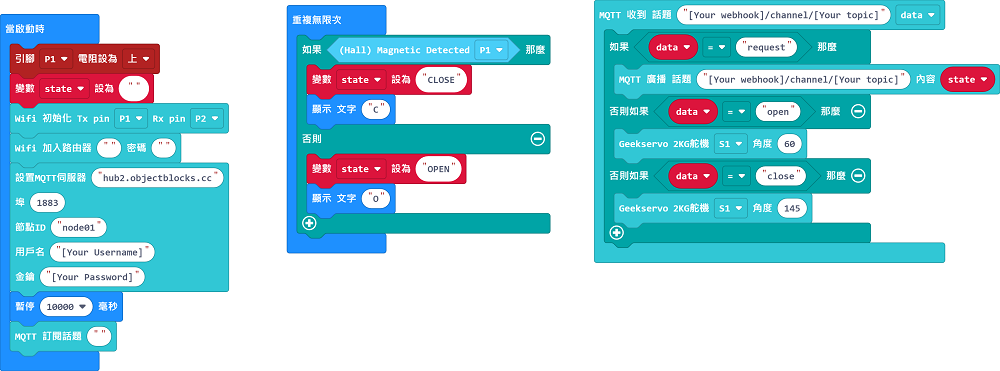
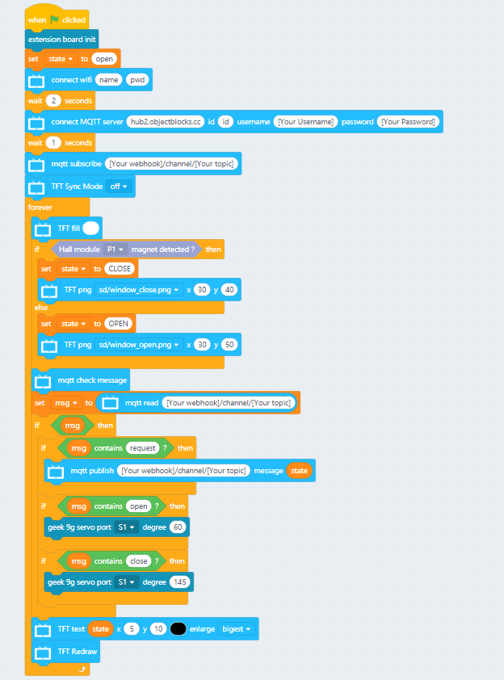
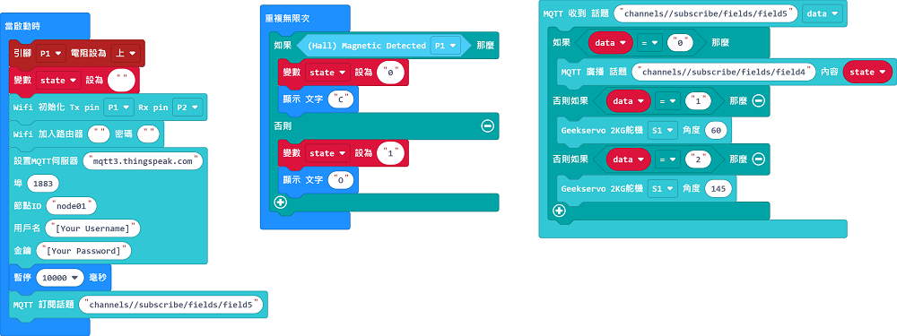
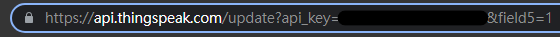

# 搖控窗戶

透過IoT平台控制門窗的開啟或關閉。

## 搭建說明書

[下載搭建說明書(右擊，另存為)](../images/window.pdf)

## 參考接線

## MakerCloud版參考程式

### Micro:bit

[參考程式](https://makecode.microbit.org/_FT8d1A07q9Rf)

### 未來板

[參考程式(右擊，另存為)](./smartWindow_makercloud.sb3)

[參考圖檔下載(右擊，另存為)](./windowpic.rar)

## ObjectBlocks版參考程式

### Micro:bit

### 未來板

[參考程式(右擊，另存為)](./smartWindow_objectblocks.sb3)

[參考圖檔下載(右擊，另存為)](./windowpic.rar)

## Thingspeak版參考程式

### Micro:bit

[參考程式](https://makecode.microbit.org/_f3w3Pj2wP12x)

### 未來板

[參考程式(右擊，另存為)](./smartWindow_thingspeak.sb3)

[參考圖檔下載(右擊，另存為)](./windowpic.rar)

### 手動發布ThingSpeak信息控制窗戶

將以下網址複製到瀏覽器貼上，更改為field5，將數值改為想發布的數值(0/1/2)。

## 示範短片

[示範短片](https://www.youtube.com/watch?v=nLj0LCgN1Uk)
