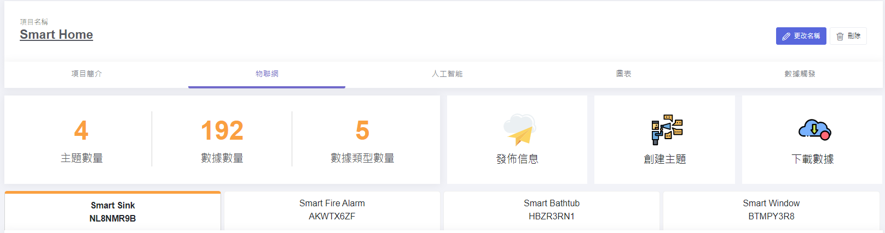
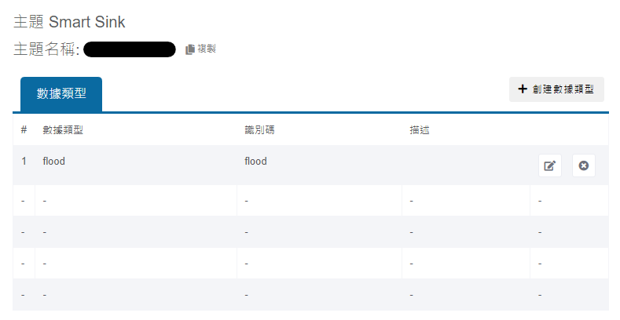
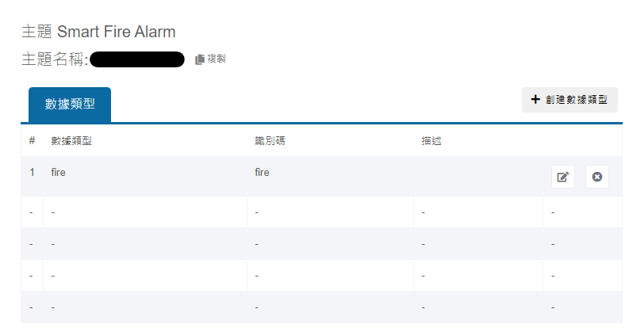
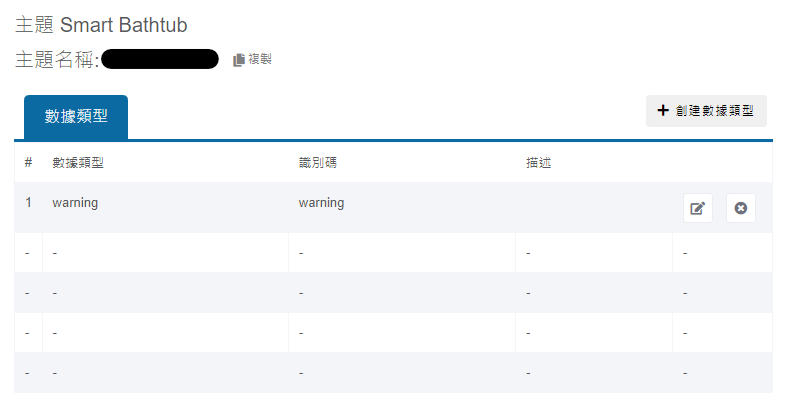
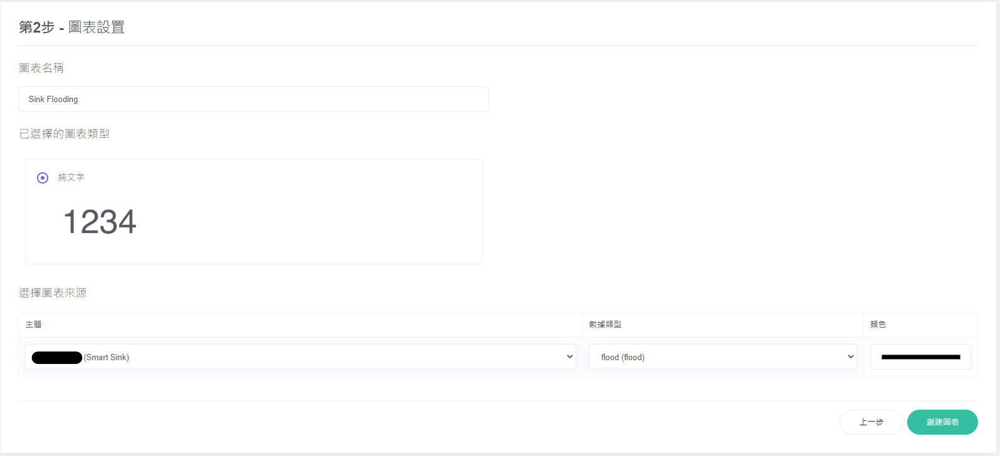
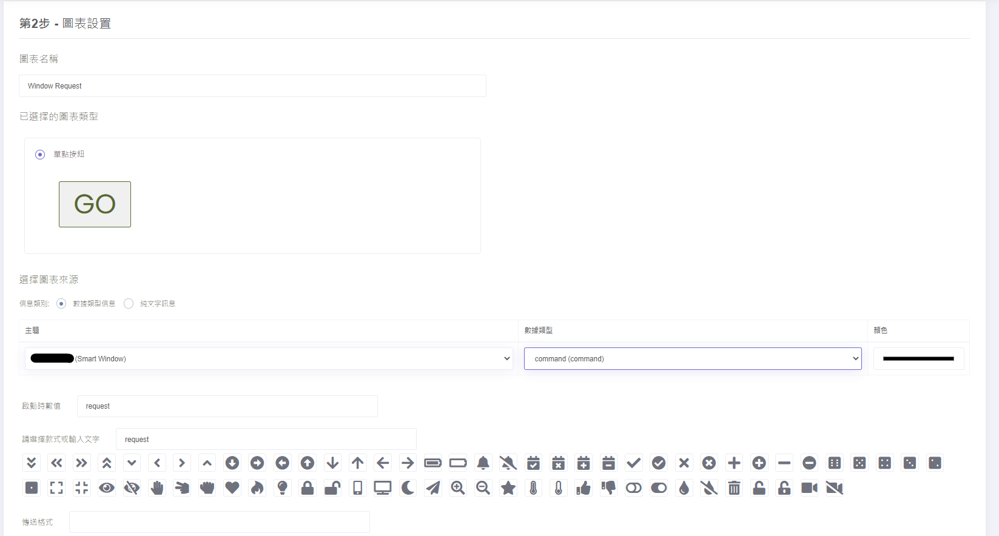

# MakerCloud平台設定

## 1. 建立MakerCloud項目，並設立4個話題

## 2. 在Smart Sink的話題裏面建立數據類型flood

## 3. 在Smart Fire Alarm的話題裏面建立數據類型fire

### 4. 在Smart Bathtub的話題裏面建立數據類型warning

### 5. 在Smart Window的話題裏面建立數據類型status與command
 

### 6. 為每個話題建立圖表，顯示話題收到的數值

### 7. 為Smart Window話題的command建立3個圖表，發佈數值request、open、close

