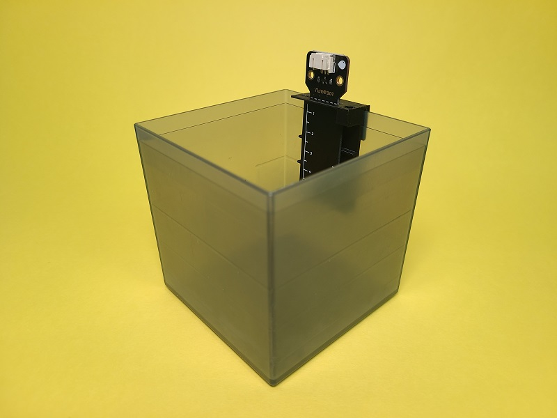
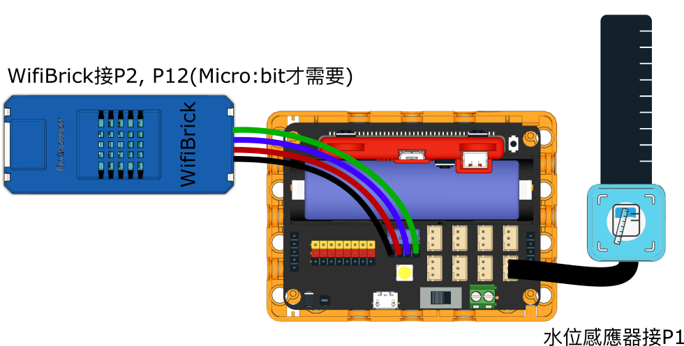
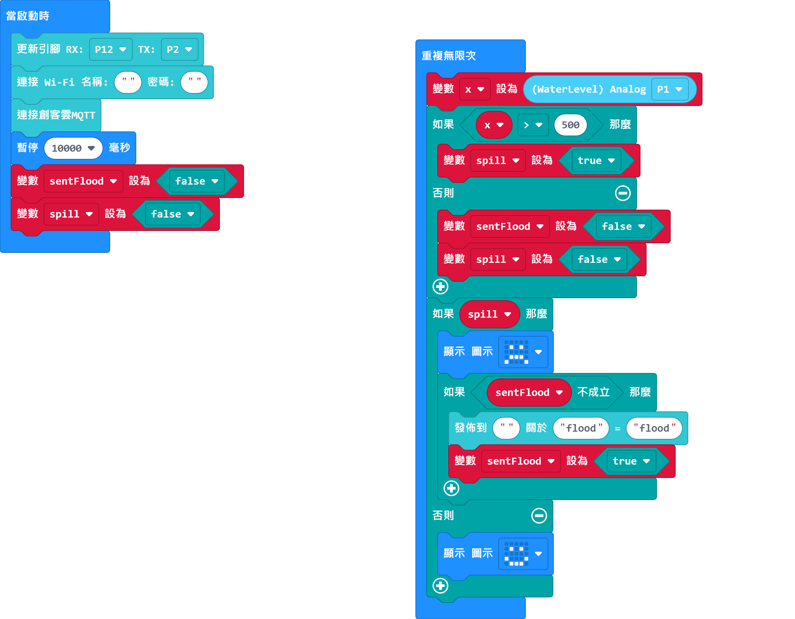
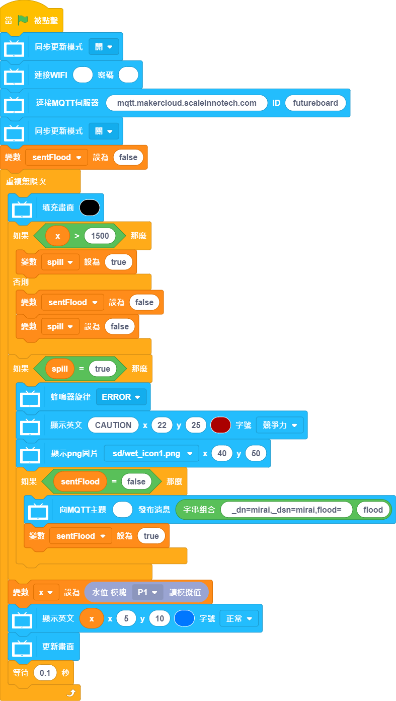
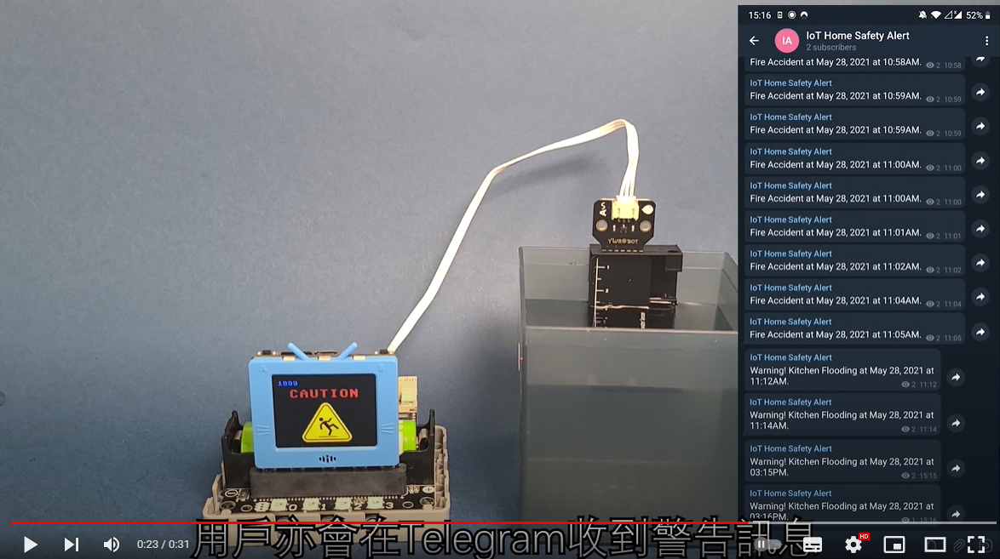

# 防浸洗手盤

假如水位超出安全水平將會透過IoT平台通知用家。

## 搭建說明書

[下載搭建說明書(右擊，另存為)](../images/sink.pdf)

## 參考接線

## MakerCloud參考程式

### Micro:bit

[參考程式](https://makecode.microbit.org/_4iCLs6HERhci)

### 未來板

[參考程式(右擊，另存為)](./smartSink.sb3)

## 示範短片

[示範短片](https://www.youtube.com/watch?v=LwzhAub01sQ)