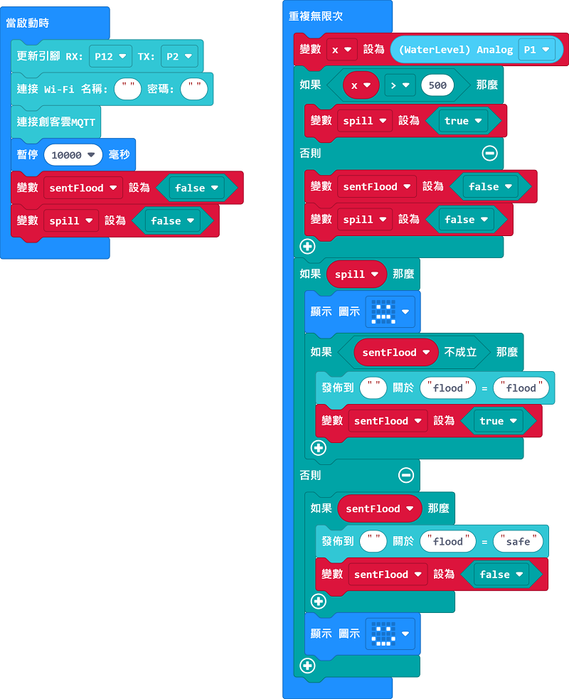
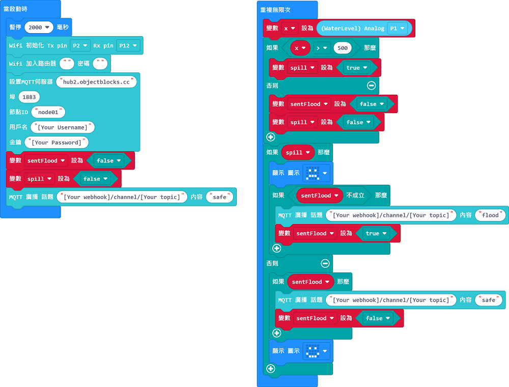

# 防浸洗手盤

假如水位超出安全水平將會透過IoT平台通知用家。

## 搭建說明書

[下載搭建說明書](https://github.com/kittenbothk/kittenbothk/raw/master/Kits/smart_home_iot/images/stove.pdf)

## 參考接線

## MakerCloud版參考程式

### Micro:bit

[參考程式](https://makecode.microbit.org/_heKcs9fRFK5c)

### 未來板

[參考程式](https://github.com/kittenbothk/kittenbothk/raw/master/Kits/smart_home_iot/instructions/smartSink_makercloud.sb3)

## ObjectBlocks版參考程式

### Micro:bit

[參考程式](https://makecode.microbit.org/_YKtCCzWz7PsY)

### 未來板

[參考程式](https://github.com/kittenbothk/kittenbothk/raw/master/Kits/smart_home_iot/instructions/smartSink_objectblocks.sb3)

## ThingSpeak版參考程式

### Micro:bit

[參考程式](https://makecode.microbit.org/_8omTCjHcjDi0)

### 未來版

[參考程式](https://github.com/kittenbothk/kittenbothk/raw/master/Kits/smart_home_iot/instructions/smartSink_thingspeak.sb3)

## 示範短片

[示範短片](https://www.youtube.com/watch?v=LwzhAub01sQ)