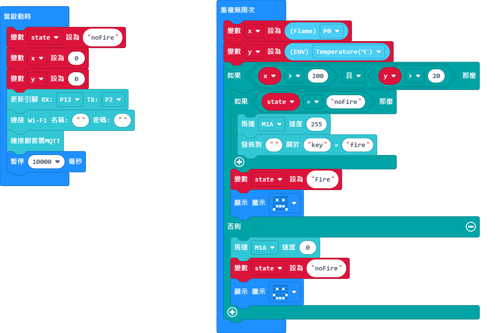
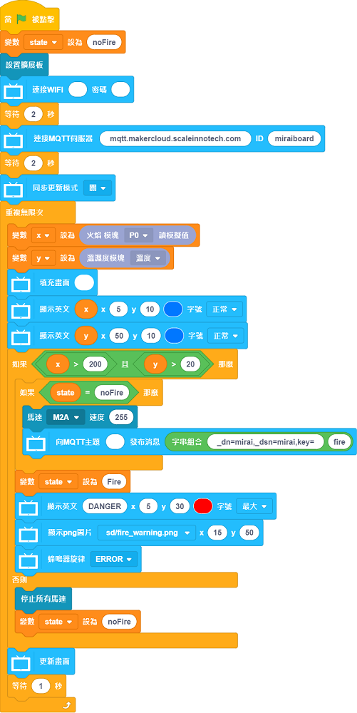

# 安全爐具

能夠在失火時立即透過IoT平台通知用家，並且撲滅火焰。

## 搭建說明書

[下載搭建說明書(右擊，另存為)](../images/stove.pdf)

## 參考接線

## 參考程式

### Micro:bit

[參考程式](https://makecode.microbit.org/_Abo2V2PDdY5R)

### 未來板

[參考程式(右擊，另存為)](./smartStove.sb3)

[參考圖檔下載(右擊，另存為)](./stovepic.rar)

## 示範短片

[示範短片](https://www.youtube.com/watch?v=n7rE02r8EJo)