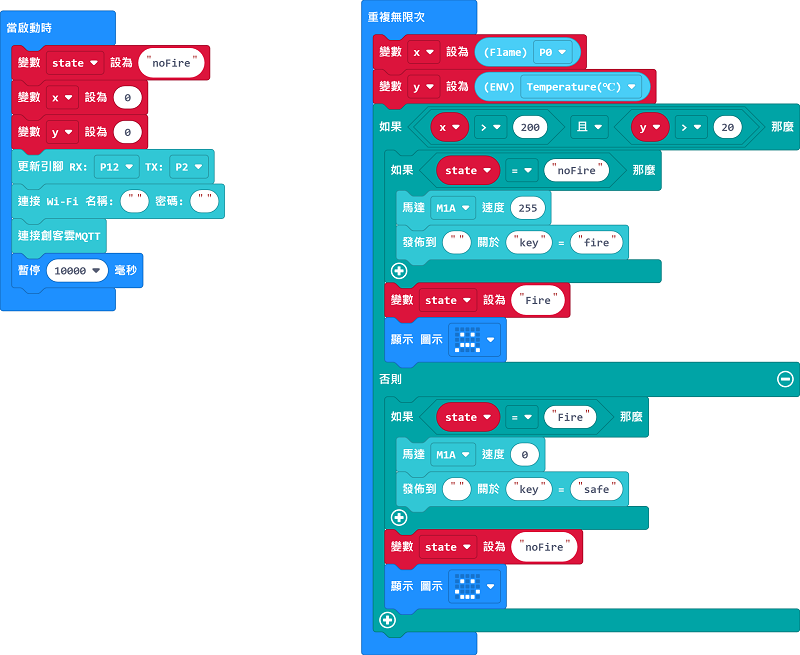
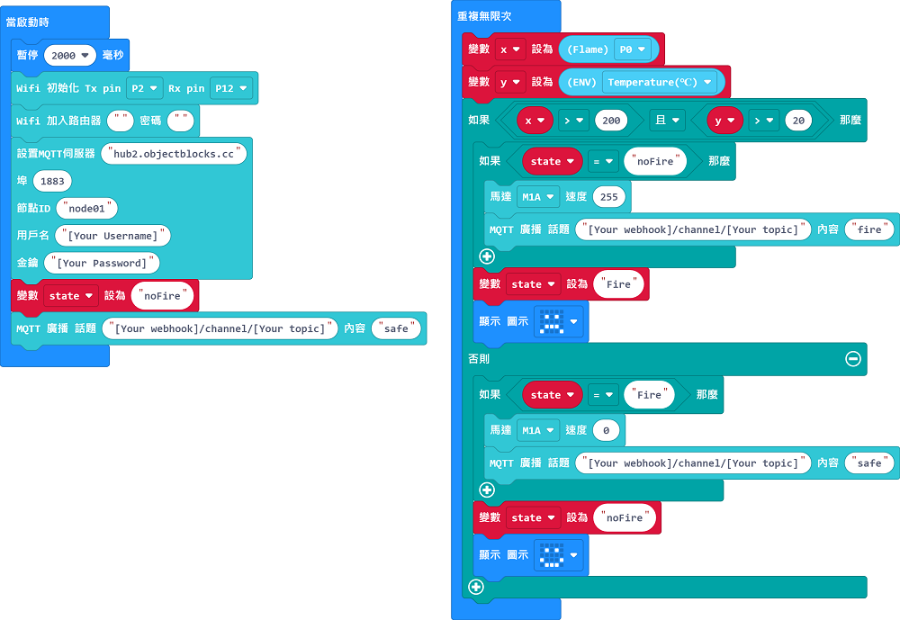

# 安全爐具

能夠在失火時立即透過IoT平台通知用家，並且撲滅火焰。

## 搭建說明書

[下載搭建說明書](https://github.com/kittenbothk/kittenbothk/raw/master/Kits/smart_home_iot/images/stove.pdf)

## 參考接線

## MakerCloud版參考程式

### Micro:bit

[參考程式](https://makecode.microbit.org/_3UcLxDX53MJu)

### 未來板

[參考程式](https://github.com/kittenbothk/kittenbothk/blob/master/Kits/smart_home_iot/instructions/smartStove_makercloud.sb3)

[參考圖檔下載](https://github.com/kittenbothk/kittenbothk/raw/master/Kits/smart_home_iot/instructions/stovepic.rar)

## ObjectBlocks版參考程式

### Micro:bit

[參考程式](https://makecode.microbit.org/_adD1DLHuChzq)

### 未來板

[參考程式](https://github.com/kittenbothk/kittenbothk/raw/master/Kits/smart_home_iot/instructions/smartStove_objectblocks.sb3)

[參考圖檔下載](https://github.com/kittenbothk/kittenbothk/raw/master/Kits/smart_home_iot/instructions/stovepic.rar)

## ThingSpeak版參考程式

### Micro:bit

[參考程式](https://makecode.microbit.org/_FLJUbz7JUi1T)

### 未來板

[參考程式](https://github.com/kittenbothk/kittenbothk/raw/master/Kits/smart_home_iot/instructions/smartStove_thingspeak.sb3)

[參考圖檔下載](https://github.com/kittenbothk/kittenbothk/raw/master/Kits/smart_home_iot/instructions/stovepic.rar)

## 示範短片

[示範短片](https://www.youtube.com/watch?v=n7rE02r8EJo)