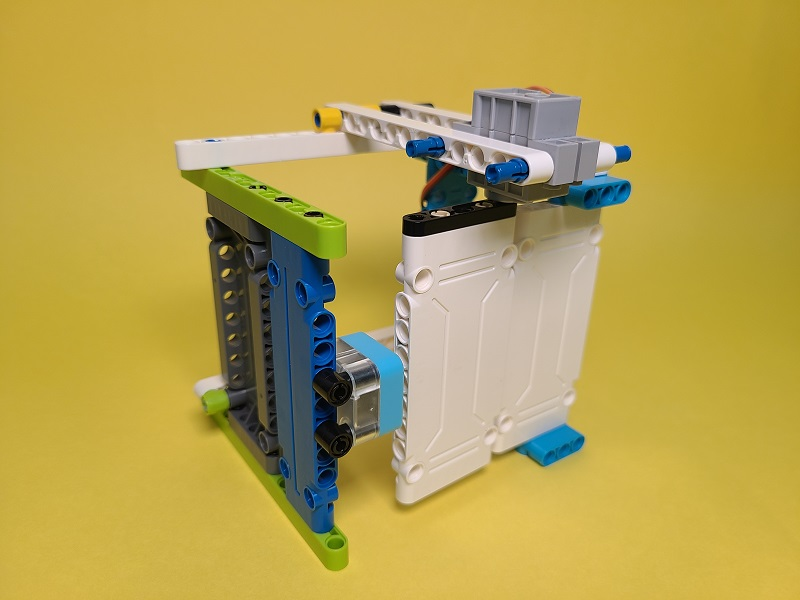
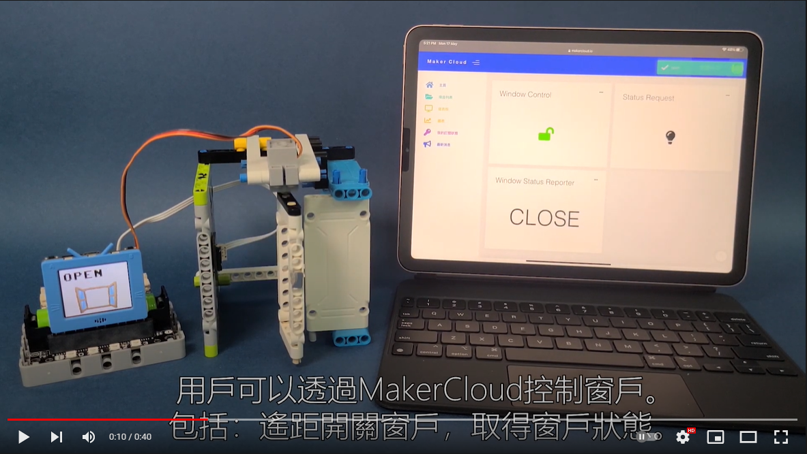
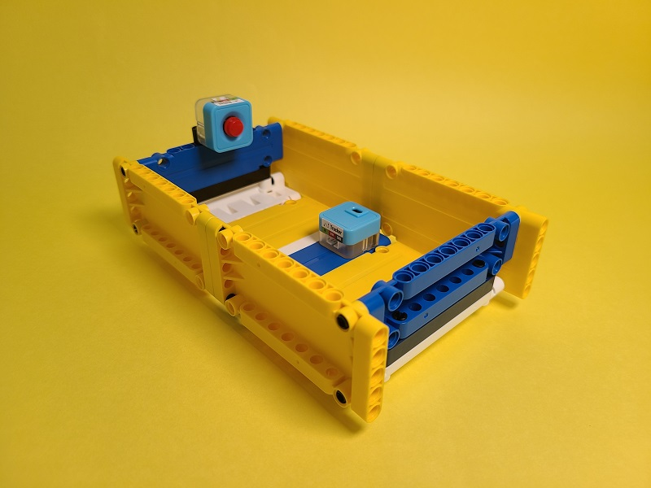

IoT Made Easy智能家居學習套件

IoT智能家居學習套件是一套針對IoT與智能家居的應用為主題的教育套件，套件包含4款應用案例，內容圍繞家居安全，包括浴室、廚房、門窗等。KittenBot希望透過此套件讓學生明白日常生活中用到的智能家電背後的原理，亦都提高家居安全的意識。

## 套件特色

- 輕易達成IoT應用
    - 令學生可以輕易學習IoT的原理
- 親手搭建案例
    - 透過動手搭建，理解應用背後的原理
- 圖像化編程
    - 支援未來板和Micro:bit的圖像化編程，令編程門檻更低
- 支援IFTTT
    - 透過MakerCloud與IFTTT，可以做到與手機連動的效果
- 採用Sugar系列感應器
    - 減卻了接線的煩惱
- 採用Robotbit Edu
    - 減卻了接線的煩惱
    
## 套件內容

- 未來板/Micro:bit x1 (選配)
- WifiBrick (Micro:bit版本)
- 4Pin WifiBrick連接線 (Micro:bit版本)
- Robotbit Edu x1
- 18650鋰電池 x1
- GeekServo 9G舵機 x1
- Sugar 磁力感應器 x1
- Sugar 紅外線感應器 x1
- Sugar 火焰感應器 x1
- Sugar 人體紅外線感應器 x1
- Sugar 雨滴水位感應器 x1
- Sugar 環境溫濕度感應器 x1
- All In One水箱水泵模組 x1
- 3D打印固定件 x1
- 塑膠積木包 x1
- 小型磁石 x1
- 3Pin連接線 x2
- 4Pin連接線 x1

## 產品展示

### 搖控窗戶

透過IoT平台控制門窗的開啟或關閉。

[示範短片](https://www.youtube.com/watch?v=nLj0LCgN1Uk)

### 防浸洗手盤

假如水位超出安全水平將會透過IoT平台通知用家。

[示範短片](https://www.youtube.com/watch?v=LwzhAub01sQ)

### 平安浴缸

假如偵測到用家在浴缸中昏迷就會透過IoT平台警告家人。

[示範短片](https://www.youtube.com/watch?v=tRQiIUIZCpo&t=1s)

### 安全爐具

能夠在失火時立即透過IoT平台通知用家，並且撲滅火焰。

[示範短片](https://www.youtube.com/watch?v=n7rE02r8EJo)