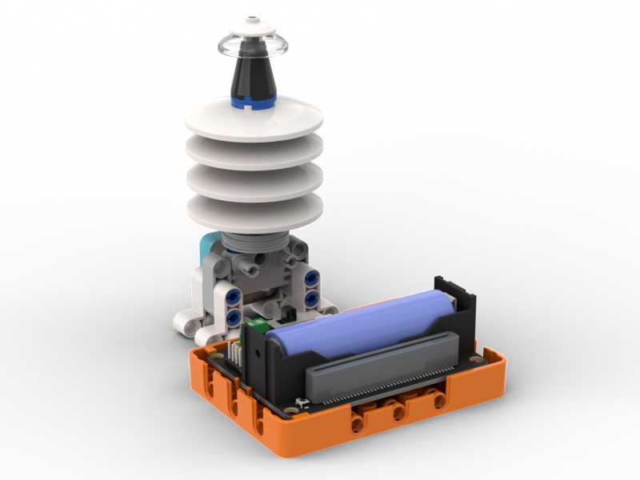
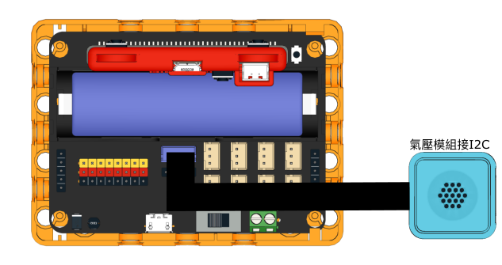
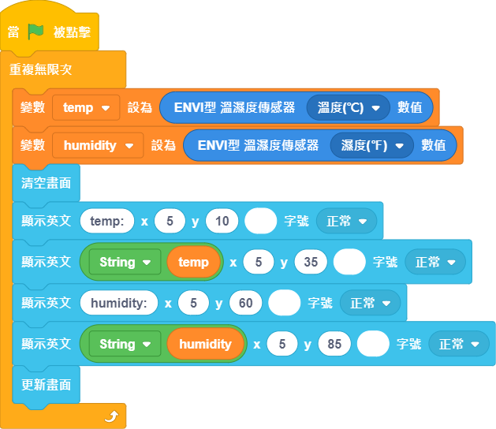
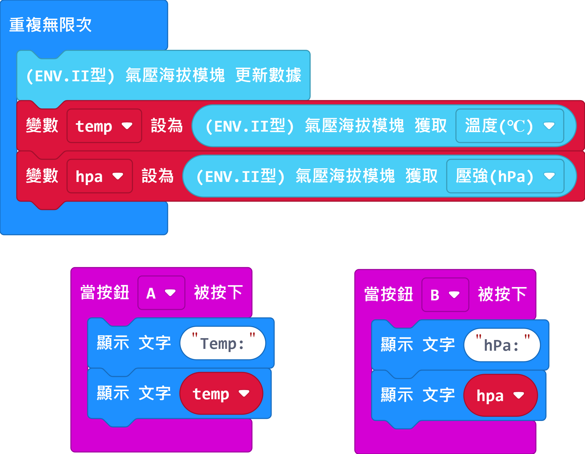

# 溫度氣壓站

一個可以檢測環境溫度和氣壓的的氣象站應用。

## 搭建說明書

[下載搭建說明書](https://github.com/kittenbothk/kittenbothk/raw/master/Kits/weatherstation/instructions/temp_atmosphere_robotbit.pdf)

## 接線圖

## 未來板範例程式

[下載範例程式](https://github.com/kittenbothk/kittenbothk/raw/master/Kits/weatherstation/sb3/1_temp_hpa.sb3)

[下載範例python程式](https://github.com/kittenbothk/kittenbothk/raw/master/Kits/weatherstation/py/1_temp_hpa.py)

## Micro:bit範例程式

[下載範例程式](https://makecode.microbit.org/_2bzDffdpHh5A)