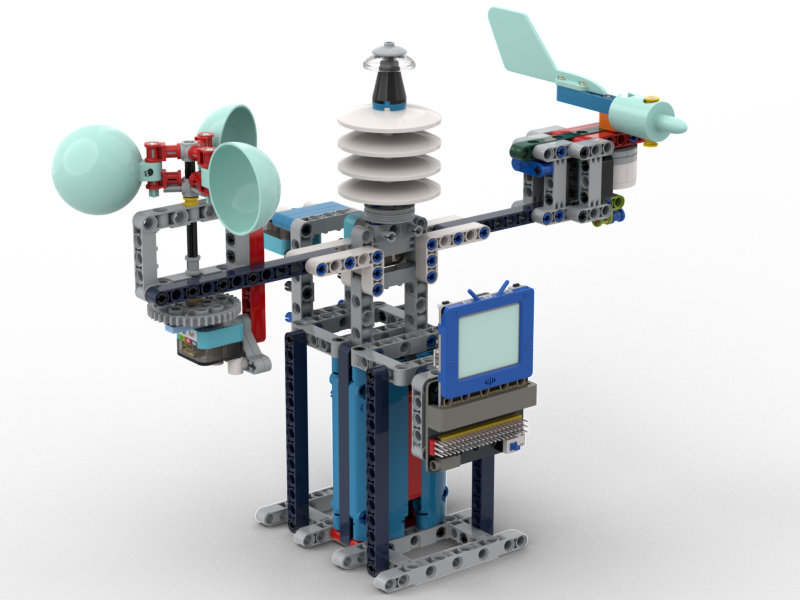
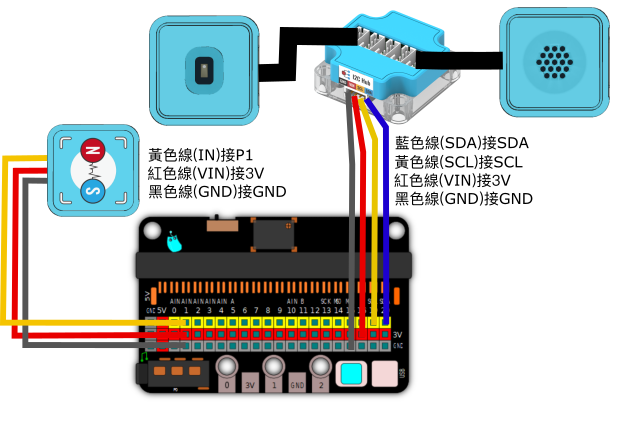
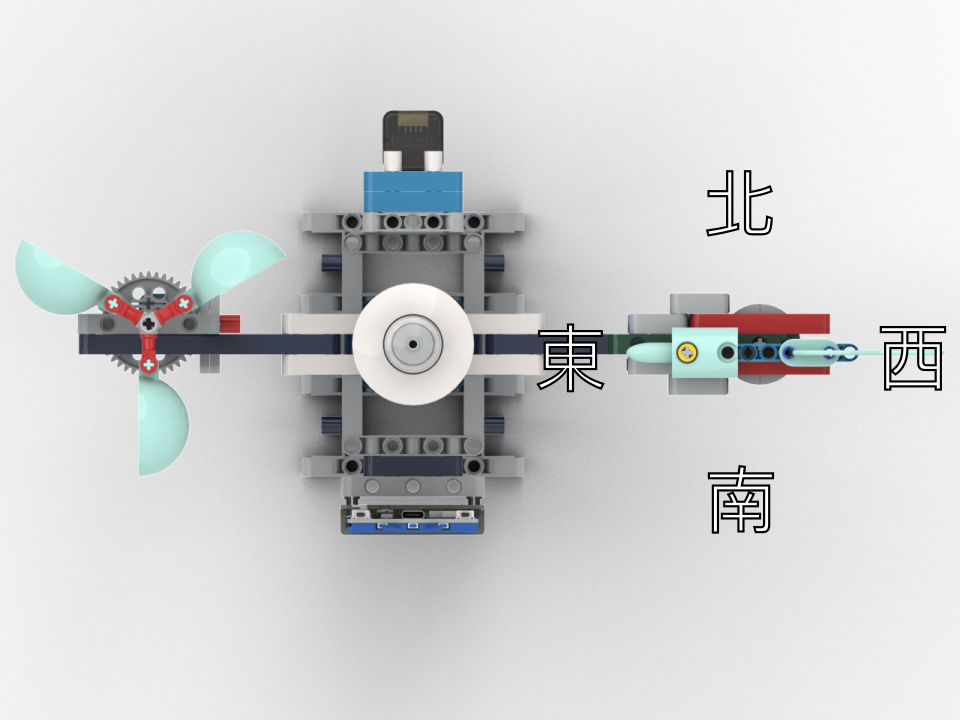

# 完整氣象站

一個可以集合所有功能的模型。

## 搭建說明書

[下載搭建說明書](https://github.com/kittenbothk/kittenbothk/raw/master/Kits/future_weather/instructions/complete_station.pdf)

## 接線圖

## 範例程式

### 未來板程式

[下載範例程式](https://github.com/kittenbothk/kittenbothk/raw/master/Kits/future_weather/sb3/7_complete_grayscale.sb3)

[下載範例python程式](https://github.com/kittenbothk/kittenbothk/raw/master/Kits/future_weather/py/7_complete_grayscale.py)

### 請按圖示將指針指向氣象站中心，然後按照手機指南針轉動整個氣象站，指針的頭部應該指向東面。

### 風向的讀數可以透過修改範例程式的數值進行校正
### 手動撥動指針指向每個方位，記錄並更改每個方位的灰度感應器所得數值

