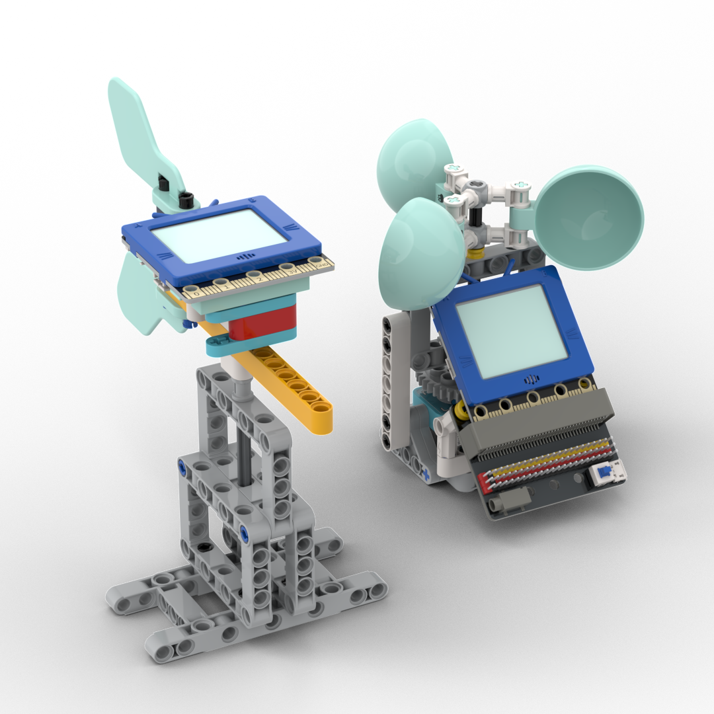
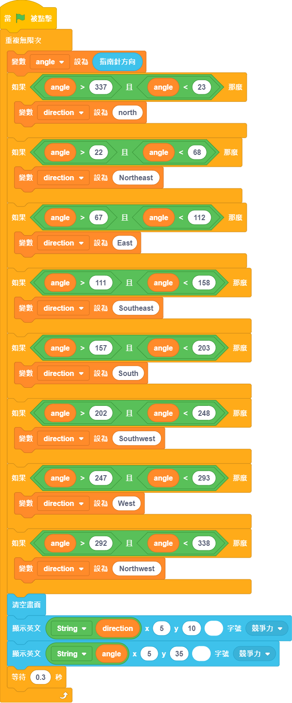

# 風速+風向檢測

一個可以檢測風速和風向的模型。

    **這個模型需要2塊未來板。**

## 搭建說明書

[下載搭建說明書](https://github.com/kittenbothk/kittenbothk/raw/master/Kits/future_weather/instructions/wind_speed+direction.pdf)

## 接線圖

## 範例程式

### 風速檢測

[下載範例程式](https://github.com/kittenbothk/kittenbothk/raw/master/Kits/future_weather/sb3/4_windspeed.sb3)

[下載範例python程式](https://github.com/kittenbothk/kittenbothk/raw/master/Kits/future_weather/py/4_windspeed.py)

### 風向檢測

[下載範例程式](https://github.com/kittenbothk/kittenbothk/raw/master/Kits/future_weather/sb3/5_winddirection.sb3)

[下載範例python程式](https://github.com/kittenbothk/kittenbothk/raw/master/Kits/future_weather/py/5_winddirection.py)