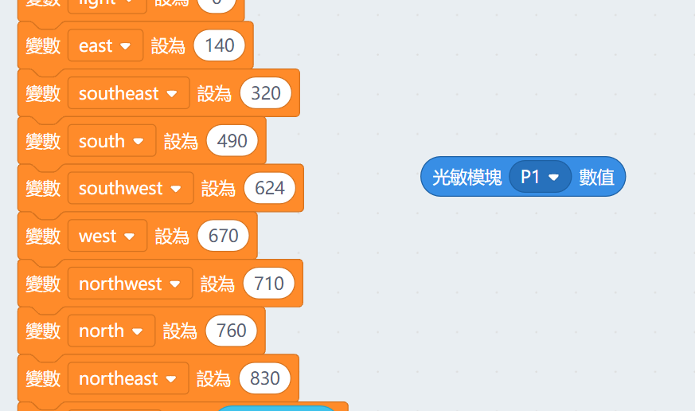

# 風向檢測

一個可以檢測風向的模型。

## 搭建說明書

[下載搭建說明書](https://github.com/kittenbothk/kittenbothk/raw/master/Kits/weatherstation/instructions/wind_direction_robotbit.pdf)

## 接線圖

## 未來板範例程式

[下載範例程式](https://github.com/kittenbothk/kittenbothk/raw/master/Kits/weatherstation/sb3/5_wind_direction.sb3)

[下載範例python程式](https://github.com/kittenbothk/kittenbothk/raw/master/Kits/weatherstation/py/5_wind_direction.py)

### 請使用指南針找出東南西北的方位，然後用手轉動指針，將灰度模塊在四個方位所錄得的數值輸入到程式裡。

## Micro:bit範例程式

[下載範例程式](https://makecode.microbit.org/_EyeC8EU5aYau)

### 請使用指南針找出東南西北的方位，然後用手轉動指針，將灰度模塊在四個方位所錄得的數值輸入到程式裡。

