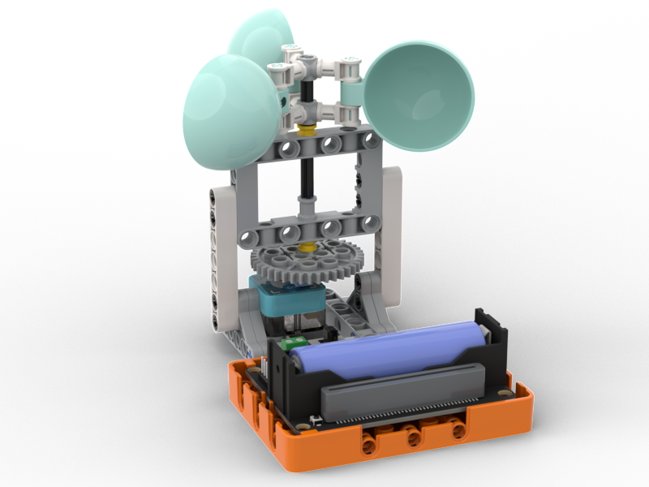
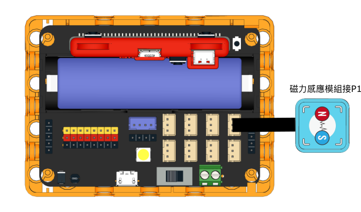

# 風速檢測

一個可以檢測風速的模型。

## 搭建說明書

[下載搭建說明書](https://github.com/kittenbothk/kittenbothk/raw/master/Kits/future_weather/instructions/windspeed_robotbit.pdf)

## 接線圖

## 範例程式

[下載範例程式](https://github.com/kittenbothk/kittenbothk/raw/master/Kits/future_weather/sb3/4_windspeed.sb3)

[下載範例python程式](https://github.com/kittenbothk/kittenbothk/raw/master/Kits/future_weather/py/4_windspeed.py)