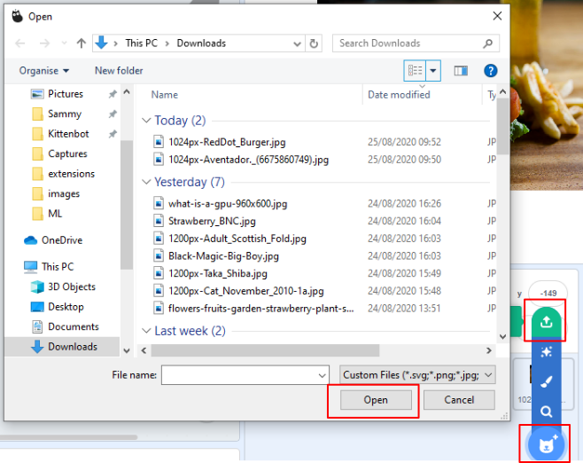

# 百度大腦插件

百度大腦是百度開發的人工智能系統，Kittenblock特地將百度大腦加入Kittenblock，讓大家可以試試百度大腦強大的功能。

## 加載百度大腦插件

按下左下角的插件加載按鈕。

選擇百度大腦插件。

加載成功！

## 百度大腦插件介紹

百度大腦有不同的功能。

### 文學創作

百度大腦擁有文學創作能力，可以作春聯和七言絕詩。

我們可以提供題材作春聯。

我們可以提供題材作七言絕詩。

### 朗讀文字

百度大腦擁有朗讀文字能力。

可以朗讀中文。

可以朗讀英文。

### 語音辨識

百度大腦擁有語音辨識能力，懂得辨認你的說話。

目前百度大腦只能聽得懂普通話。

### 物件辨認

百度大腦擁有物件辨認能力，懂得辨認不同類別的物件，例如水果、菜式、動物、汽車等。

首先上傳你想辨認的圖片。

然後將所有圖片隱藏顯示。

選擇你想辨認的類別，搭建程式。

運行結果:

### 文字辨認

百度大腦擁有文字辨認能力，可以辨認中文和英文。

    這裡額外加載了視訊偵測插件。

### 智能對話

百度大腦擁有智能對話能力，可以像手機的智能助理一樣和你對話。

## References

    By Damian Morys from New York City, United States - Aventador., CC BY 2.0, https://commons.wikimedia.org/w/index.php?curid=41292267

    By Hongreddotbrewhouse - Own work, CC BY-SA 3.0, https://commons.wikimedia.org/w/index.php?curid=33551162

    By Prathyush Thomas - Own work, GFDL 1.2, https://commons.wikimedia.org/w/index.php?curid=37417848
    
    By User:Magicwolf - https://i.imgur.com/jn0fLtw.jpg, CC BY-SA 3.0, https://commons.wikimedia.org/w/index.php?curid=5110106