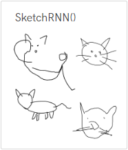

# Machine Learning 5 插件

Machine Learning 5是來自ml5.js的一個插件，它是為了令機器學習變得平易近人而開發的。它是建構於Google的TensorFlow上，所以功能和可靠性都很好。

[ml5官網](https://ml5js.org/)

## 功能一覽

### 圖像分類器

使用ml5內建的機器學習模型，可以辨認圖像的內容。

### 特徵提取器

利用分類器，讓人們能自行訓練自己專屬的機器學習模型。

### 塗鴉RNN

利用內建神經網絡，我們可以叫Kittenblock幫我們繪畫。

### 骨架網絡

透過PoseNet，可以估計人體的姿勢。

### 人臉追蹤

透過FaceAPI，可以追蹤人臉。

## 加載Machine Learning 5插件

按下左下角的插件加載按鈕。

選擇Machine Learning 5。

加載成功！

