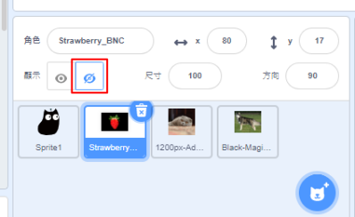
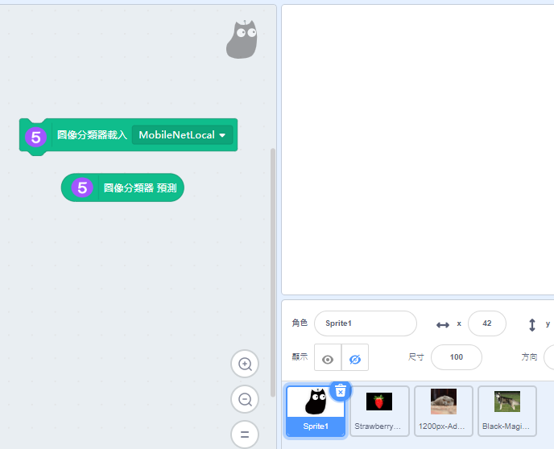

# Machine Learning 5 圖像分類器

使用ml5內建的機器學習模型，可以辨認圖像的內容。

## 加載Machine Learning 5插件

按下左下角的插件加載按鈕。

選擇Machine Learning 5。

加載成功！

電腦配置比較弱(例如：缺乏獨立顯示卡)的用戶，可以點選CPU模式提升效能。

## 辨認圖像

首先將希望辨識的圖片上傳到Kittenblock中。

將全部圖片隱藏。

點選主角色然後編程。

我們可以選擇MobileNet或者MobileNetLocal，兩者分別在於MobileNetLocal能夠在沒有網絡的情況下仍能使用。

點選想辨認的圖片然後解除隱藏。

點擊載入分類器的積木，然後按預測積木。

MobileNet模型只是包含一些日常生活常見的物件，日常生活比較少接觸的物件就可能辨認不到了。

## References

    https://www.hellotech.com/blog/whats-a-gpu-what-gpu-do-you-have
    
    By Prathyush Thomas - Own work, GFDL 1.2, https://commons.wikimedia.org/w/index.php?curid=37417848
    
    By User:Magicwolf - https://i.imgur.com/jn0fLtw.jpg, CC BY-SA 3.0, https://commons.wikimedia.org/w/index.php?curid=5110106

    By Psihopat - Own work, CC BY-SA 3.0, https://commons.wikimedia.org/w/index.php?curid=12724979