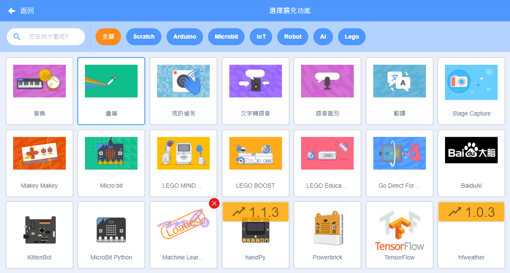
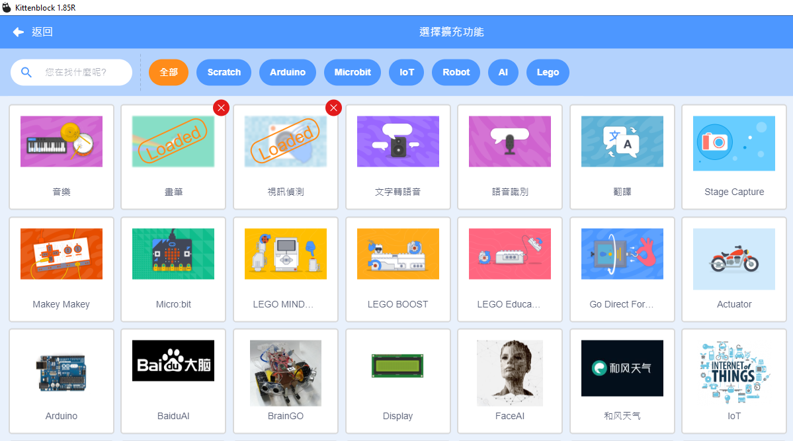
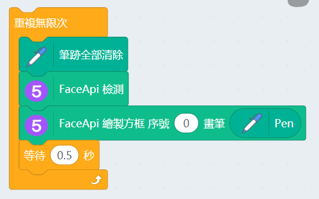
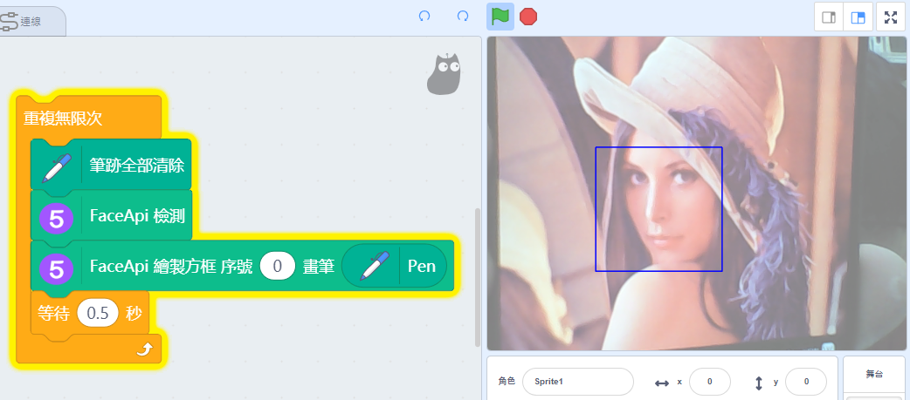
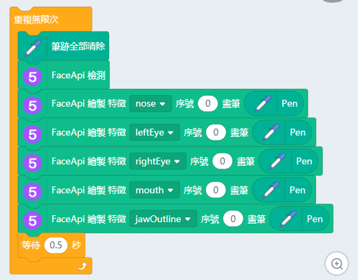
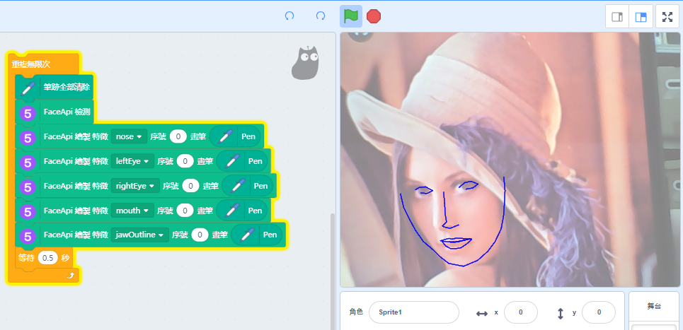

# Machine Learning 5 FaceAPI人臉追蹤

Machine Learning 5也有人臉追蹤的功能。

## 加載Machine Learning 5插件

由於今次教程需要使用視像偵測，所以我們要加載視像偵測插件。

按下左下角的插件加載按鈕。

選擇Machine Learning 5和視像偵測插件。

最後再添加畫筆插件。

加載成功！

電腦配置比較弱(例如：缺乏顯示卡)的用戶，可以點選CPU模式提升效能。

## 人臉追蹤

首先初始化人臉追蹤模型。

編寫程式並運行。

我們亦都可以追蹤人臉個別地方。

