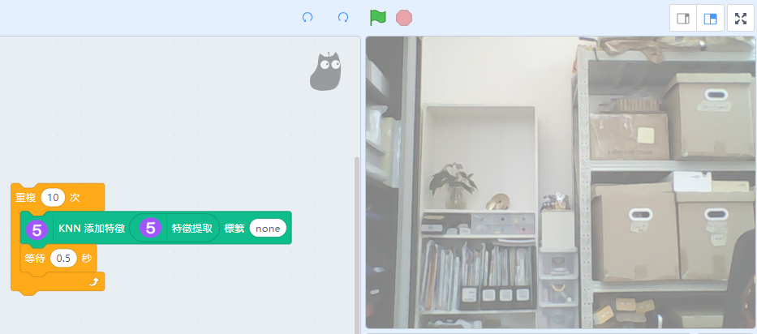

# Machine Learning 5 特徵提取器

利用分類器，讓人們能自行訓練自己專屬的機器學習模型。

## 加載Machine Learning 5插件

由於今次教程需要使用視像偵測，所以我們要加載視像偵測插件。

按下左下角的插件加載按鈕。

選擇Machine Learning 5和視像偵測插件。

加載成功！

電腦配置比較弱(例如：缺乏顯示卡)的用戶，可以點選CPU模式提升效能。

## 特徵提取器(包剪揼辨認)

首先開啟鏡頭影像和初始化特徵提取器。

編寫程式辨認手勢，首先訓練模型辨認背景。

走出鏡頭，然後運行程式。

更改標籤為rock，然後做出石頭(揼)的手勢再運行程式。

如此類推，訓練剪刀(剪)和布(包)的模型。

完成之後就可以搭建辨認的程式，我們叫小貓說出手勢的名字。

我們還可以將訓練好的模型儲存下來，以便以後重複使用。

我們可以載入之前訓練好的模型。

