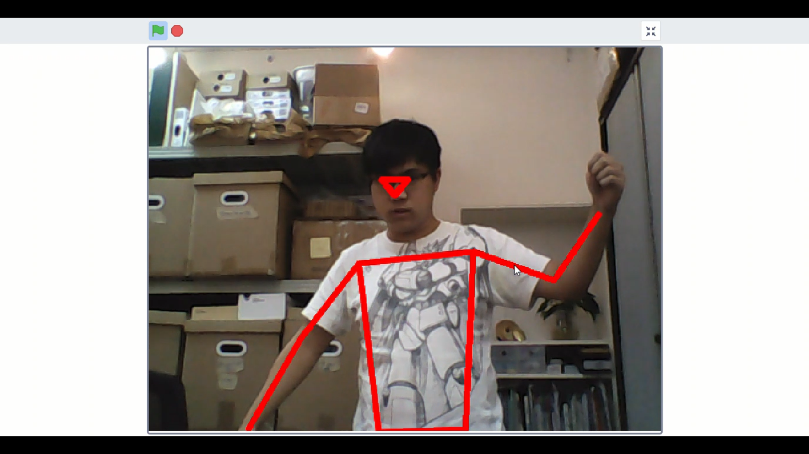

# Machine Learning 5 骨架網絡

透過PoseNet，可以估計人體的姿勢，追蹤鏡頭內人的骨架。

## 加載Machine Learning 5插件

由於今次教程需要使用視像偵測，所以我們要加載視像偵測插件。

按下左下角的插件加載按鈕。

選擇Machine Learning 5和視像偵測插件。

加載成功！

電腦配置比較弱(例如：缺乏顯示卡)的用戶，可以點選CPU模式提升效能。

## 追蹤骨架

首先初始化PoseNet模型。

搭建以下程式，要kittenblock追蹤和繪畫出人體骨架。

按下空白鍵運行程式，走到鏡頭內。

