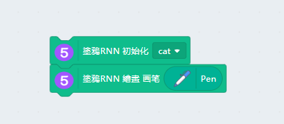
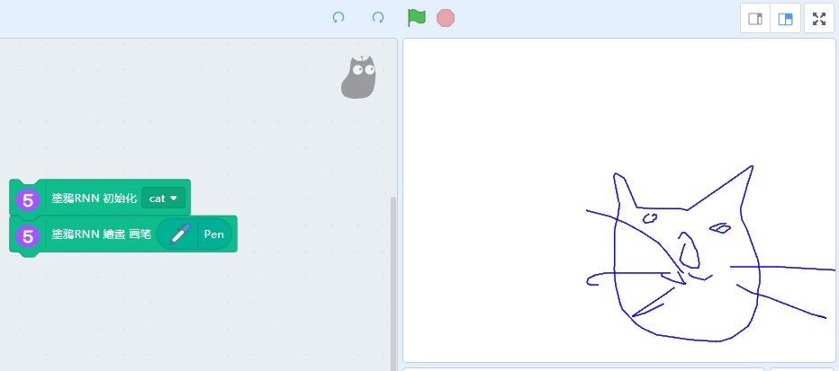
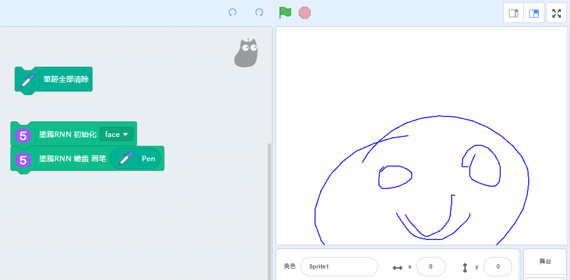

# Machine Learning 5 塗鴉RNN

利用內建神經網絡，我們可以叫Kittenblock幫我們繪畫。

## 加載Machine Learning 5插件

由於今次教程需要使用畫筆，所以我們要加載畫筆插件。

按下左下角的插件加載按鈕。

選擇Machine Learning 5和畫筆插件。

加載成功！

## 塗鴉RNN

搭建以下程式，要kittenblock為我們繪畫一隻貓的圖畫。

完成畫作。

每一次繪畫，Kittenblock都會畫出不同的圖畫。

