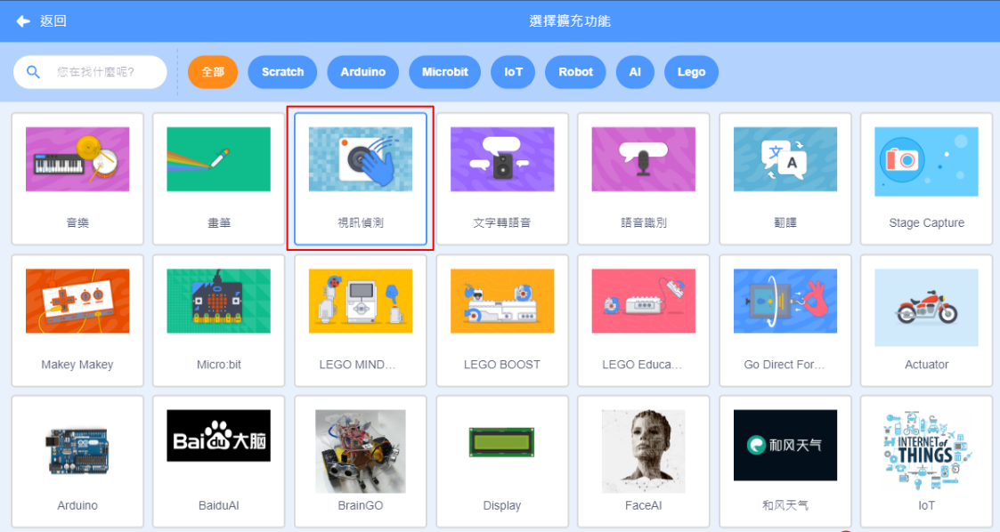
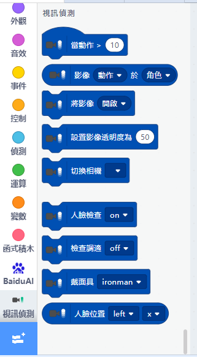
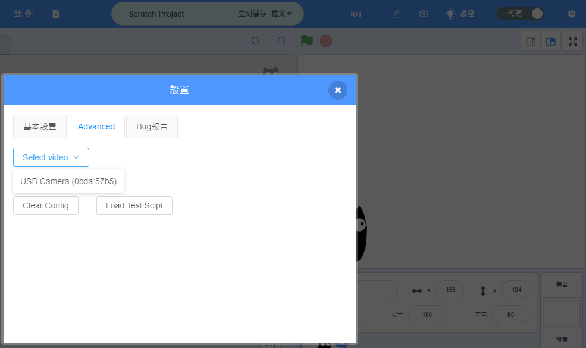
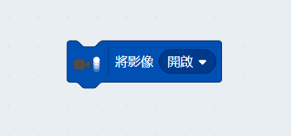
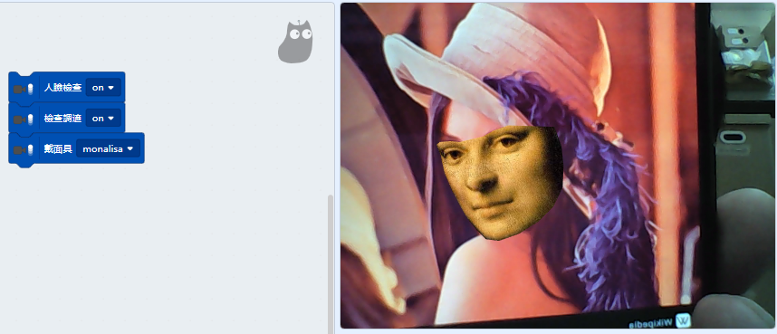
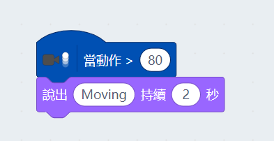
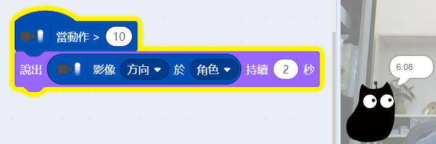
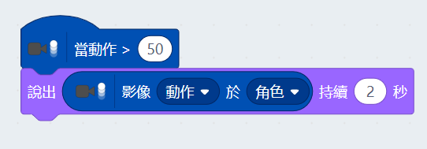

# 視訊偵測插件

在Kittenblock中我們可以利用電腦的鏡頭做視訊偵測。

## 加載視訊偵測插件

按下左下角的插件加載按鈕。

選擇視訊偵測插件。

加載成功！

## 視訊偵測

假如你的電腦沒有視像鏡頭，可以插入USB鏡頭然後到設定選擇USB鏡頭。

我們需要首先開啟鏡頭。

### 人臉偵測

視訊偵測有人臉偵測的功能，我們試試將面具套上偵測到的人臉上。

我們還可以追蹤五官的位置。

### 動態偵測

這插件也可以幫我們偵測到物件的移動，數值越少越靈敏(0至100)。

我們可以獲取物件移動的方向(-180至180)。

我們可以獲取物件移動的速度(0至100)。

