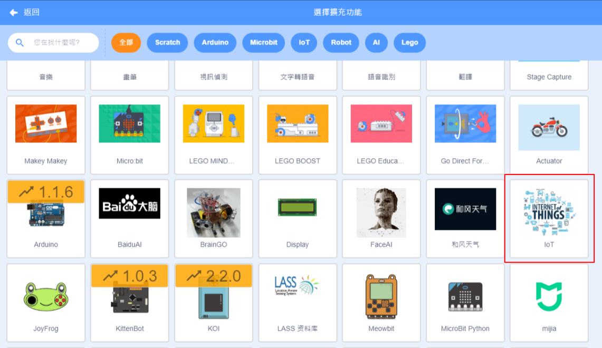
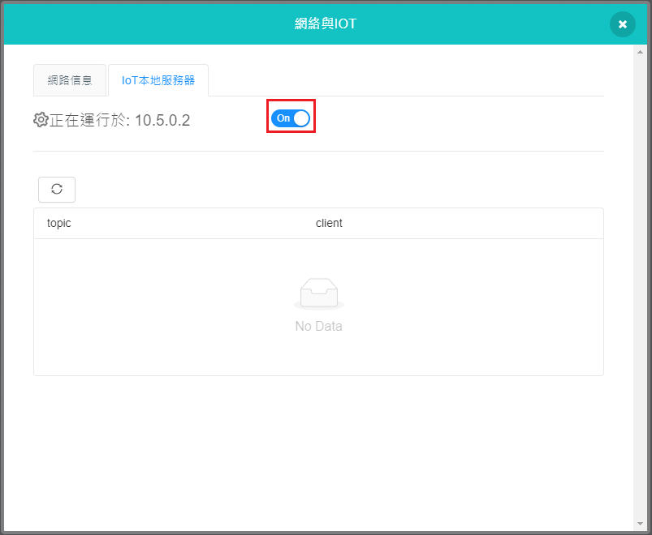
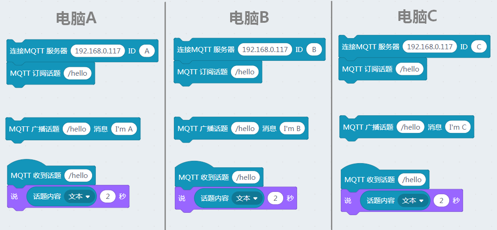

# IOT(物聯網)插件

隨著5G網絡的落實，IOT(物聯網)是近年來的熱門話題。Kittenblock中也預載了iot的插件，讓大家可以在Kittenblock中學習IOT。

## 加載IOT插件

按下左下角的插件加載按鈕。

選擇iot插件。

加載成功！

## IOT插件介紹

Kittenblock裡面可以運行本地的內聯網MQTT伺服器。

點擊IOT本地伺服器，按下開關按鈕。

頁面會顯示本地伺服器的IP地址。

運行伺服器之後，我們試試搭建這個程式。

運行程式後，可以看到舞台小貓會說出收到的資料。

如果你有多台電腦，只要你的電腦都連接到同一個網絡，所有電腦都可以連接到同一個本地內聯網伺服器。

例如，在下圖，3台電腦都連接到192.168.0.117，大家都訂閱和發佈到同一個話題，就可以互相溝通。

