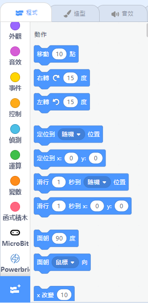
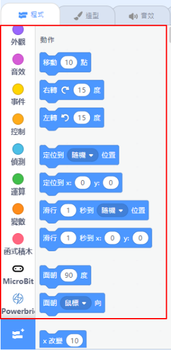
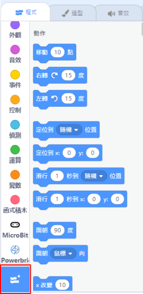
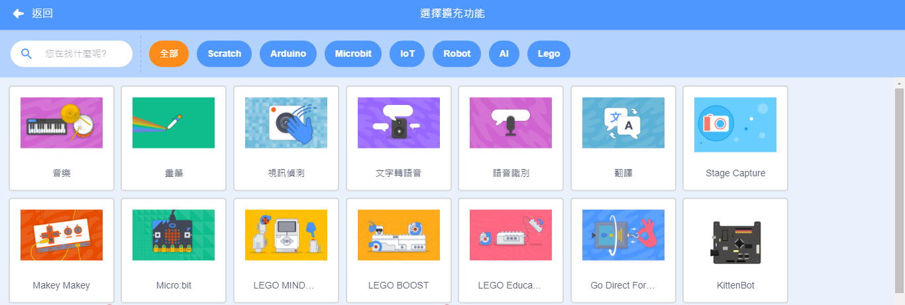
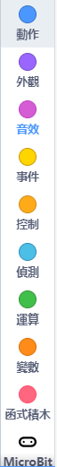
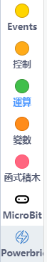

# 編程積木欄

## Kittenblock編程積木欄詳解

這是Kittenblock中的編程積木欄。

### 1. 積木欄

您可以在這裡找到編程的積木，不同類型的積木會使用不同顏色。

選擇硬件後，相關硬件的積木會出現在積木欄底部。

### 2. 加載插件

您可以在這裡加載不同的插件。

## 舞台積木與硬件積木

在Kittenblock的積木欄中有2種積木：
- 舞台積木
- 硬件積木

兩者的分別在於能否與舞台互動或離線上載。

當中有些積木是共用的，所以我們需要認清那些積木是舞台限定或硬件積木。

### 舞台積木

在舞台模式中，可以使用所有舞台與硬件的積木。

積木欄的左手邊可以看到能夠使用的積木。

這些就是舞台硬件與積木。

### 硬件積木

在代碼模式中，只可以使用硬件積木。

切換至代碼模式之後，我們可以看到在左手邊能夠使用的節目減少了。

這裡出現的積木就是硬件積木了。

