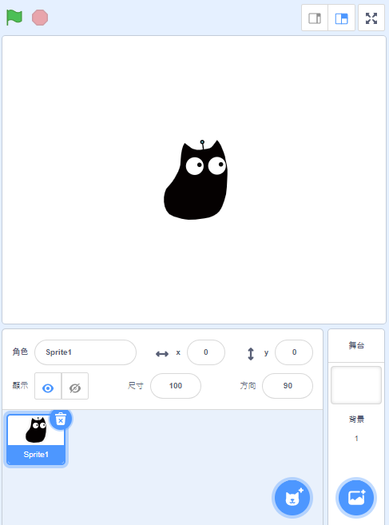
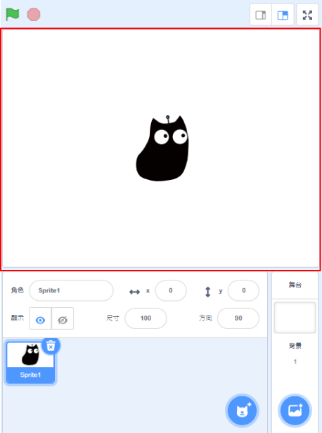
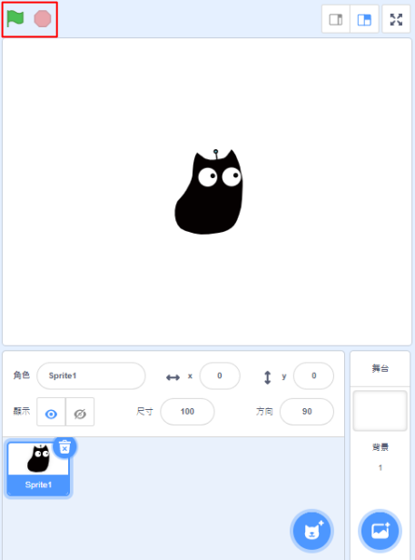
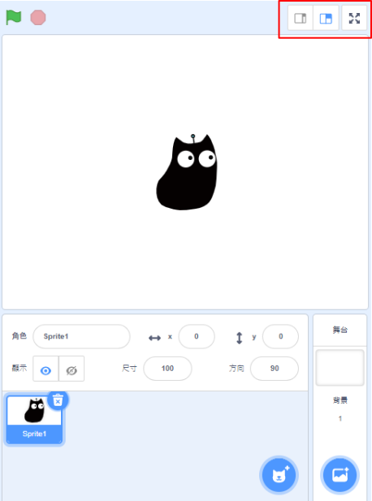
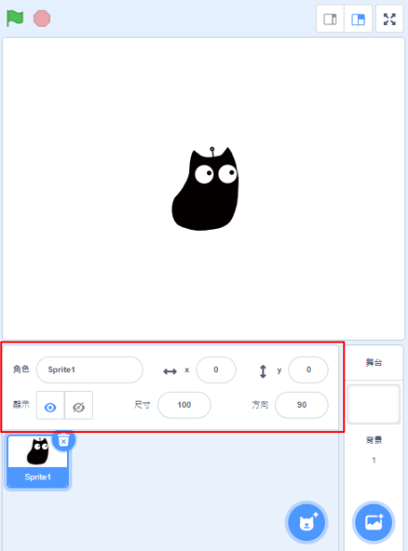
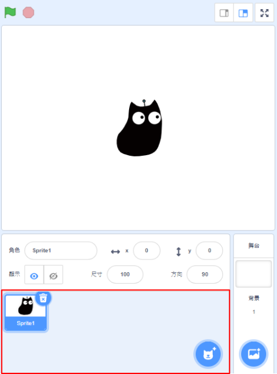
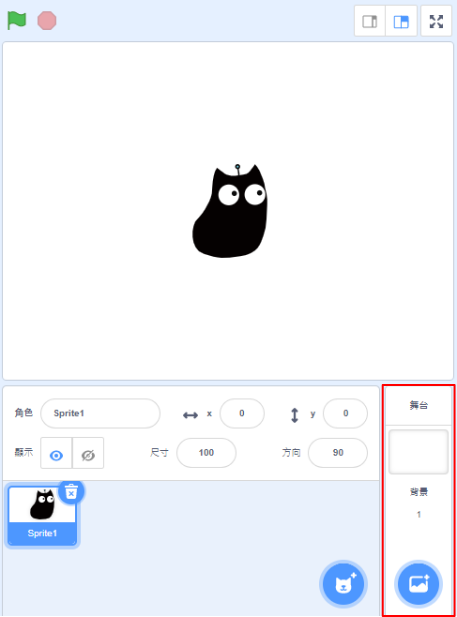

# 舞台

## Kittenblock舞台詳解

這是Kittenblock中的舞台。

### 1. 主舞台

這是主舞台，您可以在這裡移動角色。

### 2. 程序運行開關

您可以在這裡按下綠旗開始程式，紅旗停止程式。

### 3. 版面配置切換

您可以在這裡切換版面配置。

### 4. 角色資料欄

您可以在這裡修改當前角色的資料，包括名稱、位置、角度、大小及能見度等。

### 5. 角色選擇

您可以在這裡選擇角色或者刪除及增加角色。

### 5. 背景選擇

您可以在這裡選擇背景或者刪除及增加背景。

