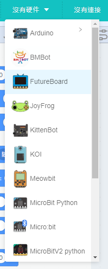
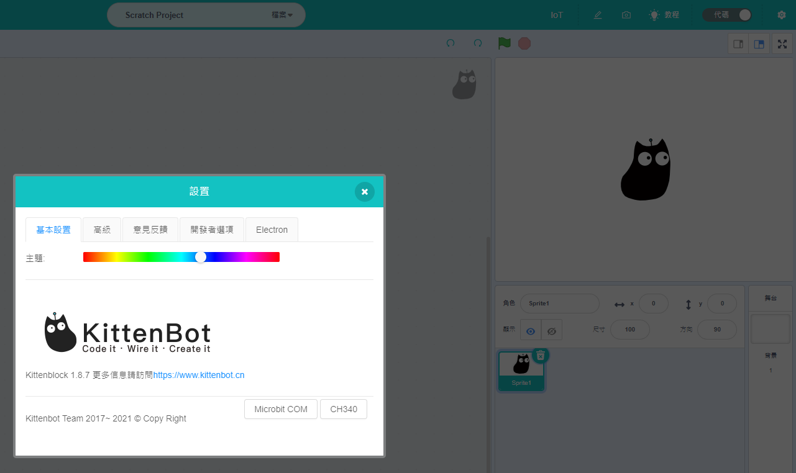

# Kittenblock主介面與工具欄

## Kittenblock主介面

打開Kittenblock之後可以看到這個主介面，這裡會介紹一下最主要的功能。

Kittenblock 1.87

## Kittenblock工具欄詳解

這裡我們會逐一看看工具欄上每個按鈕的功用。

### 1. Kittenblock登入

您可以在這裡登入或建立你的Kittenblock帳號。

登陸帳號有以下好處：
1. 可以使用Kittenbot雲端伺服器
2. 可以任意使用Kittenbot各種高級智能服務
3. 可以將你的創作分享到Kittenbot社區
4. 可以將專案儲存在雲端，以便在其他地方存取

### 2. 選擇語言

您可以在這裡選擇顯示語言。

### 3. 硬件選擇

您可以在這裡選擇硬件。

### 4. 連接硬件

您可以在這裡連接硬件。

### 5. 編程範例

您可以在這裡載入示範程序。

### 6. 升級固件

您可以在這裡上傳固件。

### 7. 更改專案名稱

您可以在這裡命名專案。

### 8. 儲存與載入

您可以在這裡儲存與載入專案。

### 9. IOT本地伺服器

您可以在這裡設定IOT本地伺服器。

### 11. 編程區截圖

您可以在這裡對編程區的內容截圖。

編程區為空的時候不允許截圖。

### 12. 切換至代碼模式

您可以在這裡切換至Python代碼模式。

### 13. 設定

您可以在這裡打開設定。

這裡可以安裝驅動，更改外觀等。

