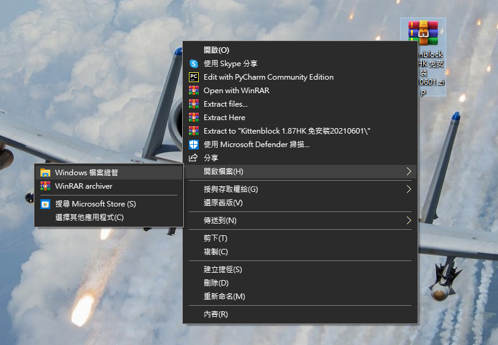
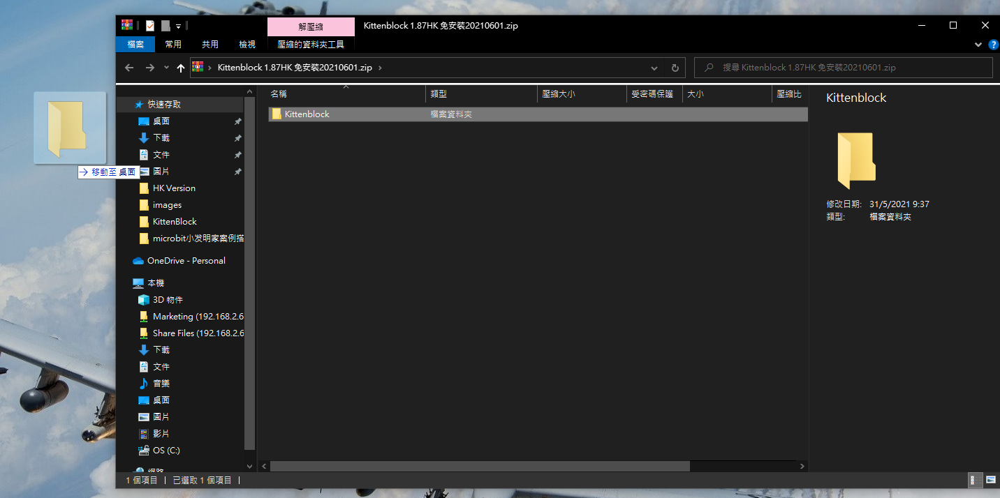

# Kittenblock安裝

KittenBlock是KittenBot的自家編程平台。

## Kittenblock下載

### 下載地址

Windows系統：

打開連結： [Kittenblock 1.88 下載](https://bit.ly/KittenblockHK188) ，下載KittenBlock。

  

### 安裝KittenBlock

右鍵zip檔案，在開啟檔案的選項裡面選擇Windows檔案總管，打開Kittenblock.zip檔。

    你亦都可以使用winrar等的程式打開及解壓縮。

將內容解壓到桌面。

    注意！Kittenblock資料夾不能夠放到另一個資料夾入面！

點擊Kittenblock.exe打開Kittenblock。

## 安裝KittenBlock後，還要安裝驅動

點擊右上角的小齒輪。安裝Microbit COM和CH340。

安裝過程大約需要數分鐘。

## 軟件排錯：

### 1. KittenBlock打開時白屏或藍屏？

這是因為管理員權限不夠。

### 解決方法，右鍵Kittenblock圖示點擊屬性，更改兼容性和權限。

### 2. KittenBlock的硬件欄顯示沒有硬件

### 解決方法：重新啟動KittenBlock