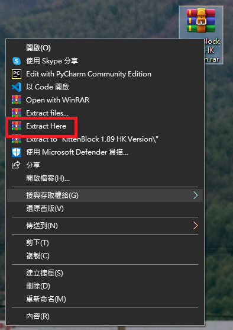
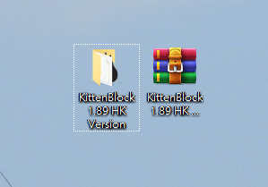
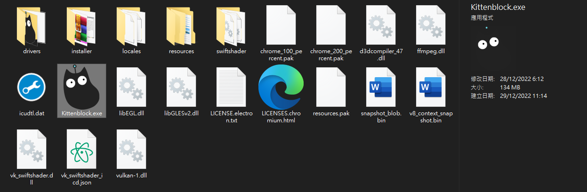
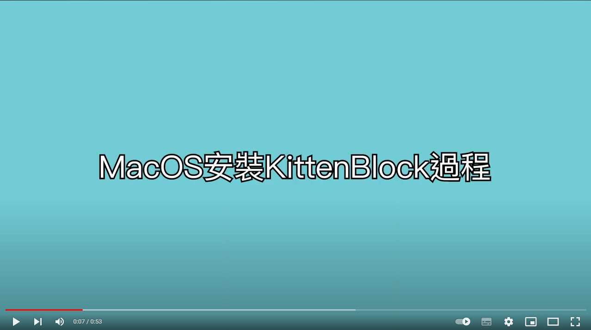
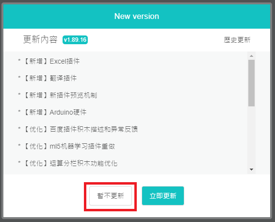
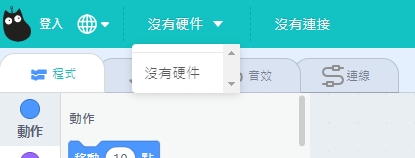

# Kittenblock安裝

KittenBlock是KittenBot的自家編程平台。

## Kittenblock下載

### 下載地址

Windows系統：

[Kittenblock 1.89.16 下載](https://drive.google.com/file/d/14lhHpzHQKgzpd0A8dJQ0i39rTHaPLDsO/view?usp=share_link)

MacOS系統：

[Kittenblock 1.89 下載](https://bit.ly/KittenblockHK18911Mac)

  

### 安裝KittenBlock(Windows)

將KittenBlock.rar檔解壓縮。

    可以使用winrar等的程式打開及解壓縮。

解壓縮後會得到一個KittenBlock的資料夾。

打開這個資料夾，打開KittenBlock.exe。

#### 安裝示範短片

[Windows安裝示範短片](https://www.youtube.com/watch?v=sU0zmLy1aQ8)

### 安裝KittenBlock後，還要安裝驅動

點擊右上角的小齒輪。安裝Microbit COM和CH340。

## 安裝KittenBlock(Mac)

將KittenBlock zip檔解壓縮。等待解壓縮完成後打開KittenBlock應用程式即可。

#### 安裝示範短片

[MacOS安裝示範短片](https://youtu.be/U8nrqviWDlI)

## KittenBlock更新

    假如KittenBlock通知有更新可安裝的話，由於KittenBlock香港版與國內版有分別，請務必選擇暫不更新，以確保程式的穩定性。KittenBot HK會自行釋出KittenBlock的新版本。

## 軟件排錯：

### 1. KittenBlock打開時白屏或藍屏？

這是因為管理員權限不夠。

### 解決方法，右鍵Kittenblock圖示點擊屬性，更改兼容性和權限。

### 2. KittenBlock的硬件欄顯示沒有硬件

### 解決方法：重新啟動KittenBlock