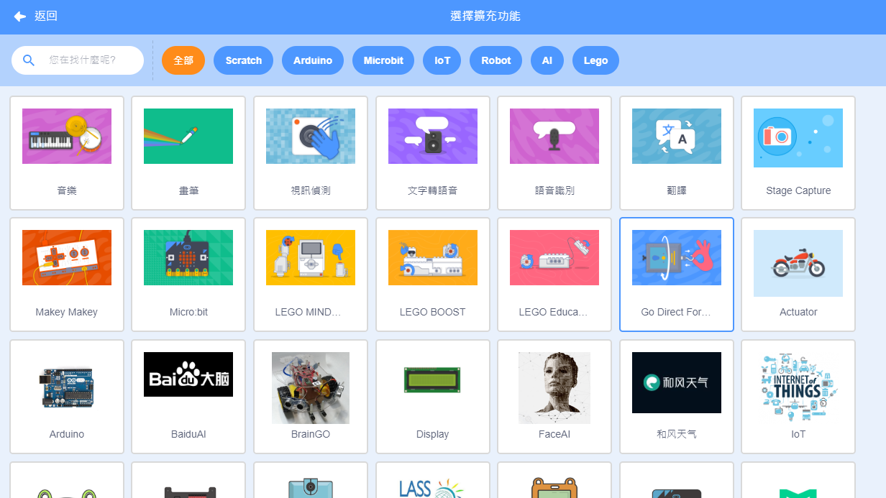
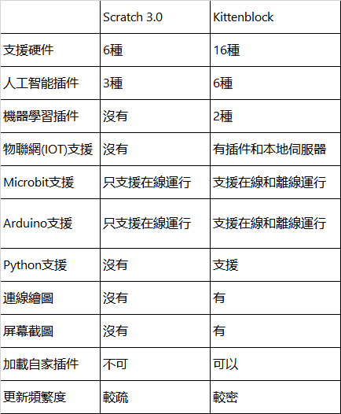

# Kittenblock VS Scratch 3.0

既然Kittenblock是基於MIT的Scratch 3.0而建成的，大家心中可能有一個疑問：

除了支持Kittenbot插件之外，Kittenblock對比起Scratch 3.0其實有什麼分別呢？

相比起Scratch，Kittenblock的優點主要在於新增的功能和插件。

在下面我們會詳細了解Kittenblock的獨特之處：

## 特點1: 插件又多又強大

Kittenblock的插件比Scratch更多而且更加強大，Kittenblock預載了不同AI和機器學習的插件，實在與時並進。相比起來，Scratch的插件就顯得又貧乏又過時了。

Kittenblock的插件數量眾多。

Scratch的插件數量比較少。

在相同的插件上，Kittenblock也額外增加了其他功能。

## 特點2: 與時並進的編程

現時編程教育已經逐漸進步到AI，IOT，甚至Python。Scratch 3.0還是停留在圖像化的編程，相反Kittenblock已經容許用家使用Python編程，更加搭載了AI和IOT的插件，支援與時並進的編程教育。

Kittenblock的Python編輯器。

Scratch就只可以用積木的圖像化編程。

## 特點3: 支援更多硬件

Scratch所支援的插件比較少，只支援Lego Mindstorm、Lego Boost、Makey Makey與Microbit。當中Lego的套件動輒超過數千港元，一般學校實在難以負擔。

相反，Kittenblock除了支援以上硬件之外還支援Kittenbot自家產品，甚至Arduino與米家智能家居。

大家可以對照一下兩者之間支援的硬件種類。

## 特點4: 支援上載程式離線運行

對硬件編程的好處之一是可以將程式上載到硬件上，讓硬件可以不用連著電腦也能運行。

可是Scratch就只是可以做到在線編程，不可以上載程式離線運行。

相反Kittenblock則支援上載程式到硬件，增強了大家創作的靈活性。

## 特點5: Kittenblock獨家功能

Kittenblock除了支援Scratch本身的功能之外，它亦增加了自家的功能，令軟件更加全面。

Kittenblock新增了例如IOT本地伺服器，Python編輯器，連線繪圖器，畫面截圖等等的功能。

詳細介紹可以參考： [Kittenblock自家功能逐個捉](./kittenbot_function/index)

## 特點6: 支援自家插件

在Scratch之中，我們不可以增加自家插件，只能使用MIT提供的插件。

在Kittenblock中，我們可以加裝自家插件，不用再限於軟件預載的插件。

假如大家有興趣自行編寫插件，Kittenblock就正正提供了這個渠道。

## 特點7: 更新頻密

假如大家有用過Scratch 2.0，你就會發現其實Scratch 3.0與2.0的分別不大，而且MIT也不常更新Scratch的功能。

相反Kittenblock的話，官方勤奮地更新Kittenblock，持續地推出新的功能和改進現有功能。

## Kittenblock與Scratch的比較

