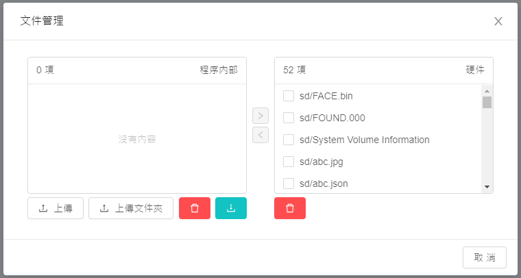
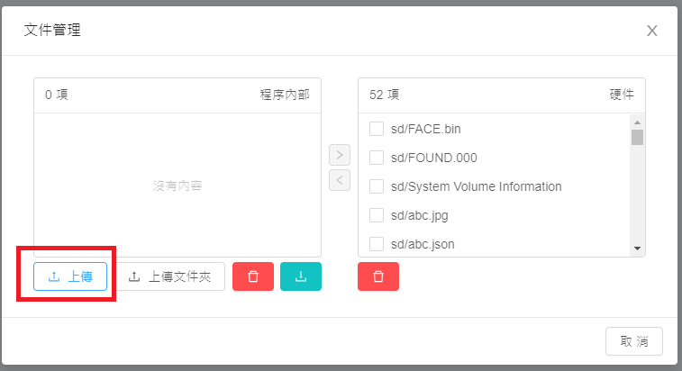
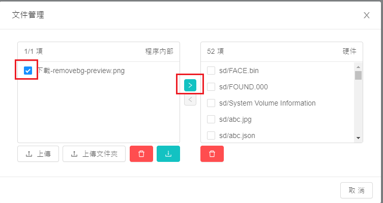
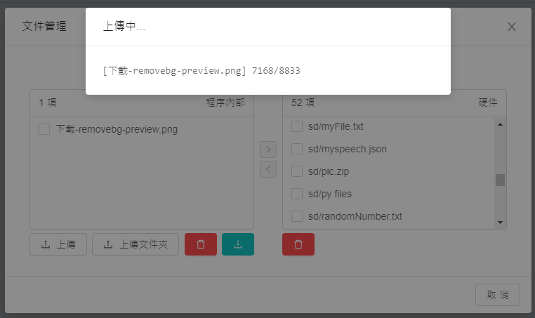
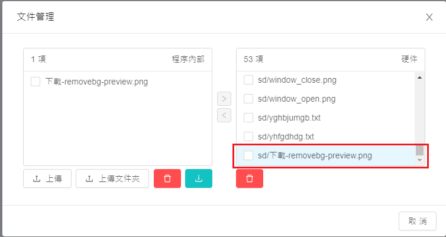
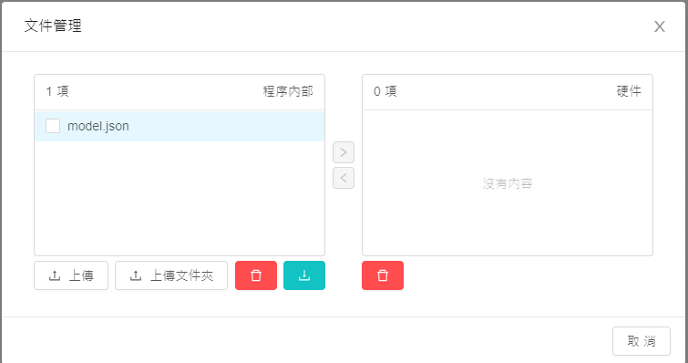
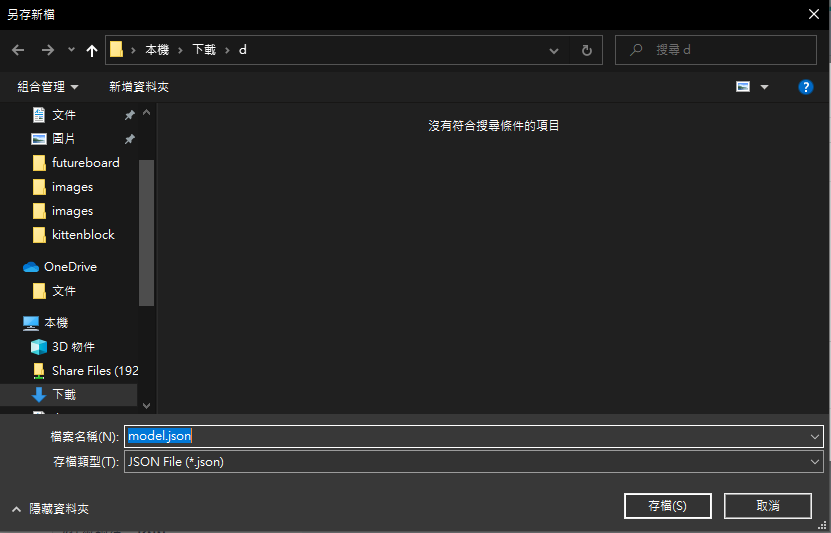
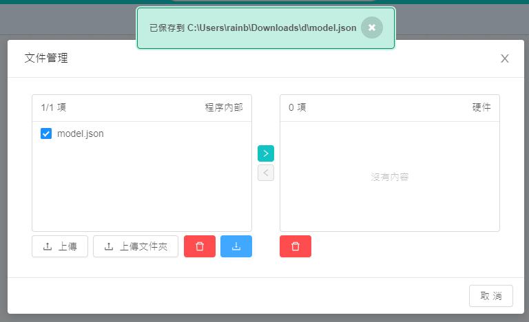

# KittenBlock硬件文件管理

在Kittenblock裡面加入了對硬件上的文件管理系統，讓大家能輕鬆上載檔案到例如未來板之類的文件。

另外Kittenblock的程序所的生成文件都會在文件管理系統裡面存取得到。

## 文件管理系統

### 1. 上傳文件到硬件

首先在Kittenblock連接硬件。點擊上方的文件。

然後你就會看到硬件上現有的文件。

按上傳並從電腦選擇你想上傳的文件。

剔選文件然後按箭嘴，文件就會上傳到硬件。

### 2. 從文件中匯出檔案

程序所生成的檔案可以在文件管理系統裏存取。

點擊上方的文件。

剔選文件然後按下載。

