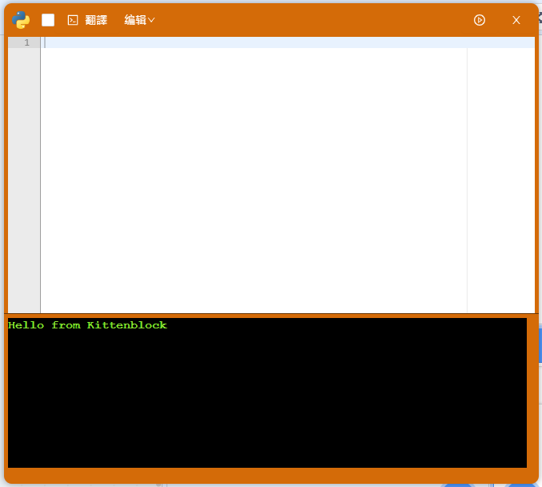
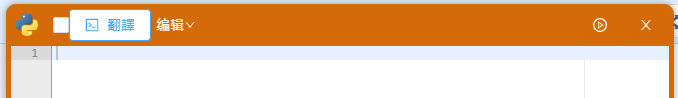
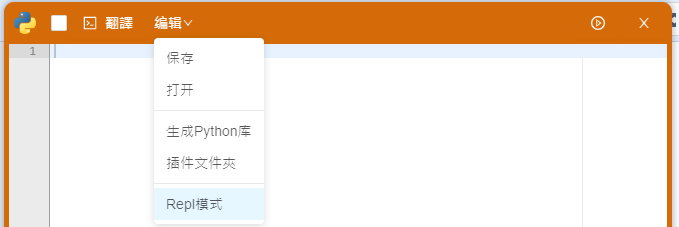
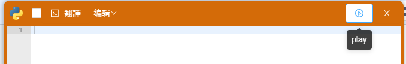

# 內置Python編輯器

我們之前在介面介紹提過Kittenblock可以切換至Python模式，我們現在會詳細看看內置的Python編輯器。

### 1. 自動翻譯

在編程區搭建的積木會實時地自動變為Python代碼。

### 2. 手動翻譯

將當前編程區的積木翻譯成Python代碼。

### 3. 編輯

打開或保存當前的Python代碼。

### 4. 運行/上載

運行程式或上載程式到硬件。

