# 繪製接線圖功能

在使用硬件創作的時候，我們很多時都會想規劃硬件的接線圖，有見及此，Kittenbot特地開發了繪製接線的插件，讓大家能輕鬆規劃硬件接線，更容易分享自己的設計。

## 繪製接線圖

接線欄可以在這裡找到。

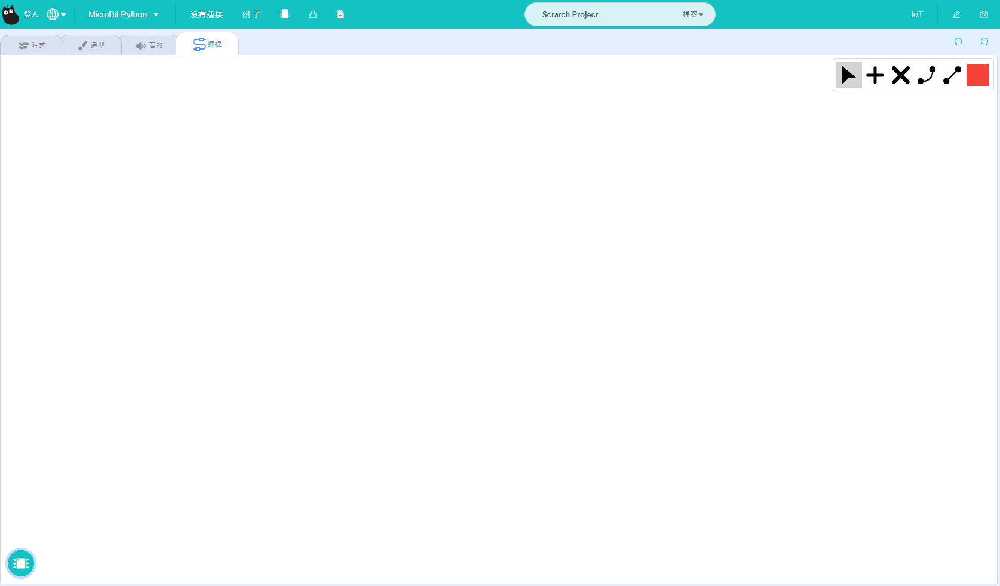

### 1. 加入硬件

我們可以在這裡加入硬件。將滑鼠移到按鈕上面，選項菜單就會出現。

#### 選擇硬件

我們可以在這裡選擇硬件。

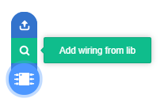

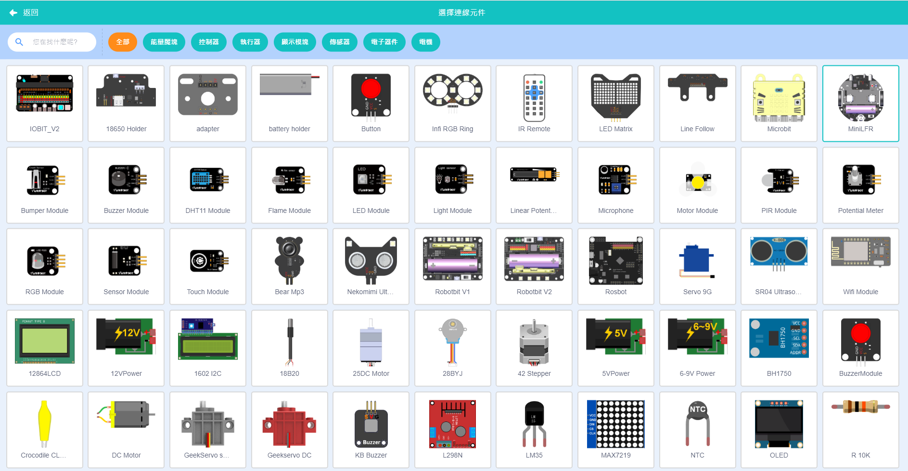

#### 上傳硬件

我們可以在這裡上傳本地硬件。

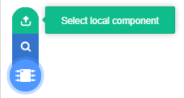

### 2. 硬件接線

選擇硬件之後就可以開始接線。

我們可以選擇個別硬件，調教大小、角度和位置等。

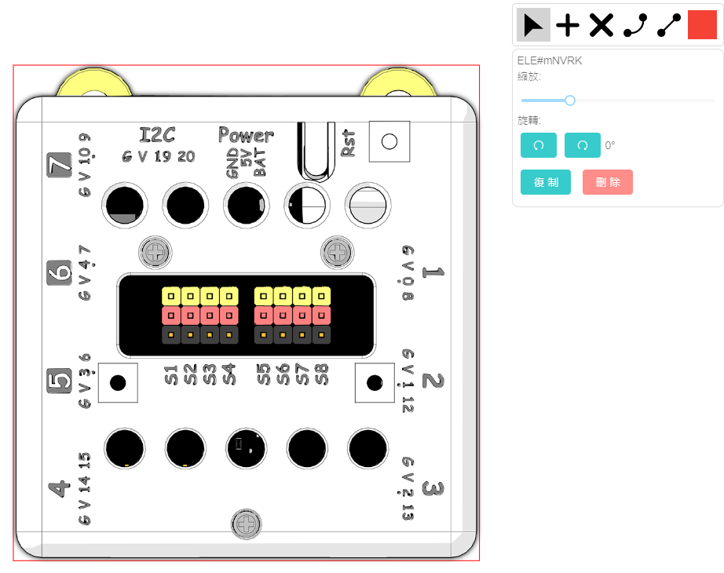

選擇創建點，然後選擇顏色。

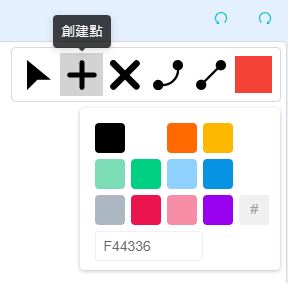

在硬件上點擊就會建立接線點。

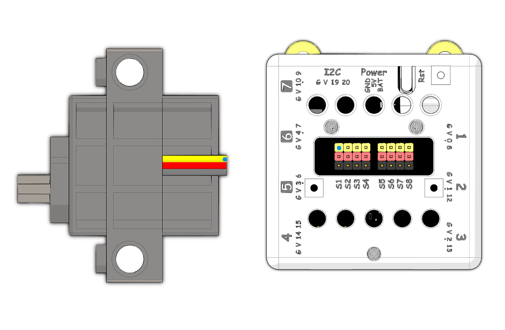

點擊連線，然後連接2點。

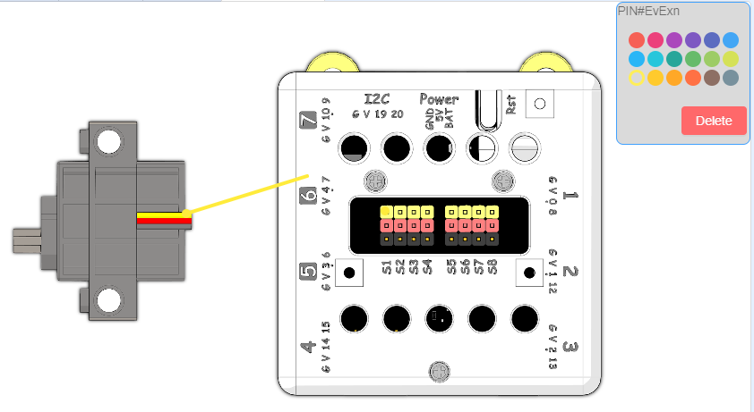

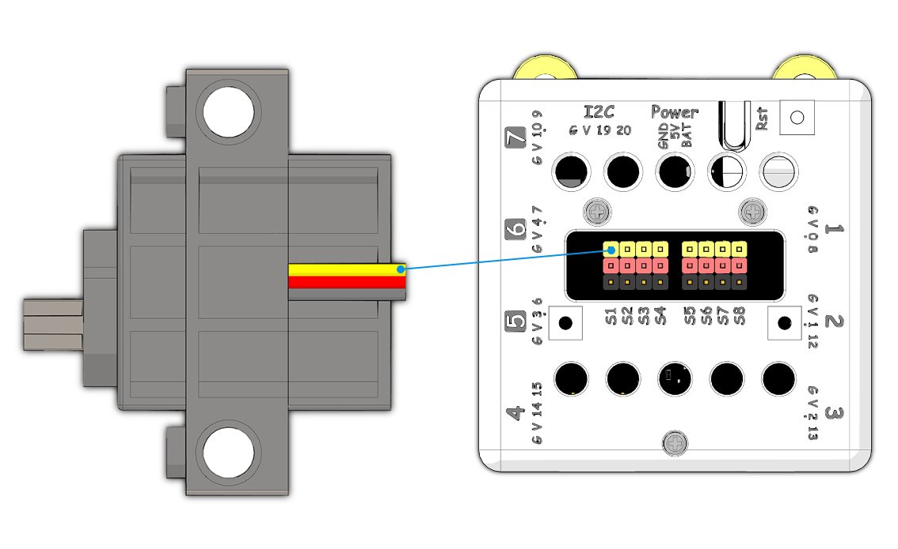

點擊創建圓弧點，在線條上點擊，之後拖曳圓弧點就可以建立曲線。

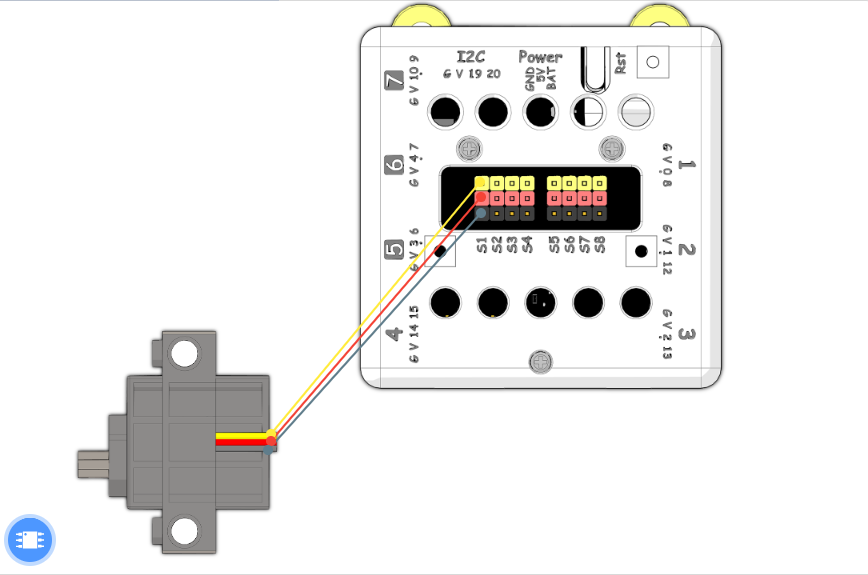

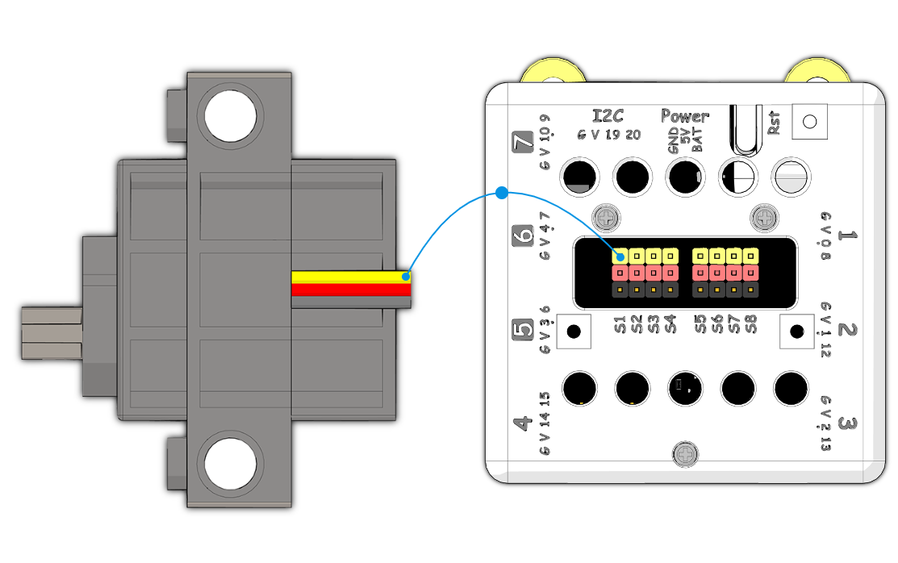

如果要刪除點，選擇刪除點然後點擊想刪除的點。

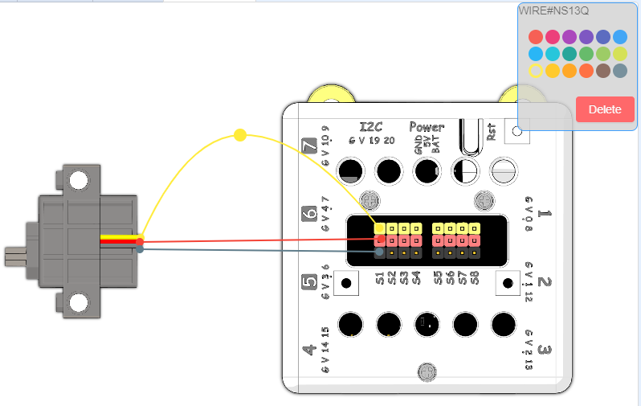