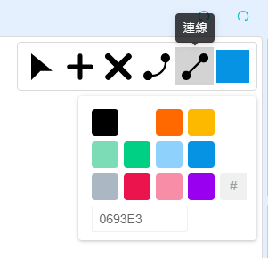
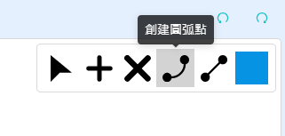
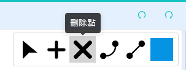

# 繪製接線圖功能

在使用硬件創作的時候，我們很多時都會想規劃硬件的接線圖，有見及此，Kittenbot特地開發了繪製接線的插件，讓大家能輕鬆規劃硬件接線，更容易分享自己的設計。

## 繪製接線圖

接線欄可以在這裡找到。

### 1. 加入硬件

我們可以在這裡加入硬件。將滑鼠移到按鈕上面，選項菜單就會出現。

#### 選擇硬件

我們可以在這裡選擇硬件。

#### 上傳硬件

我們可以在這裡上傳硬件。

### 2. 硬件接線

選擇硬件之後就可以開始接線。

我們可以選擇個別硬件，調教大小、角度和位置等。

在硬件上雙擊，建立接線點。

點選接線點之後我們可以更改顏色。

由接線點拖曳出線段，連接到另一個接線點。

接線之後，我們可以移動硬件，接線不會因此斷開。

我們也可以繪製彎曲的接線。

在線段上雙擊，建立接線點。

拖曳接線點，拖出曲線。

