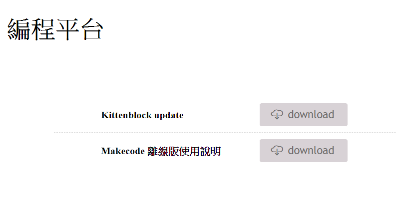
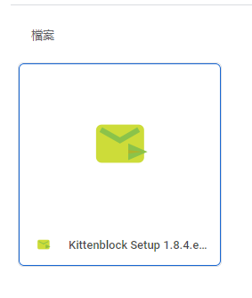
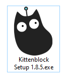
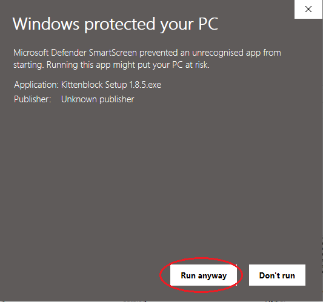
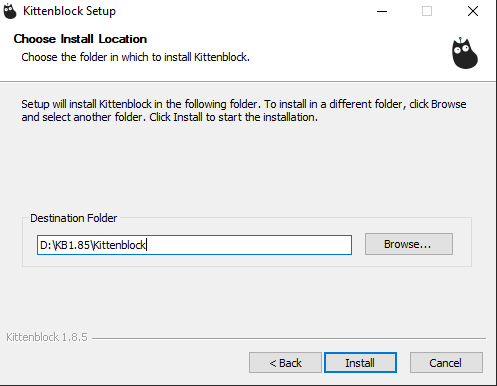
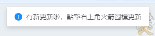
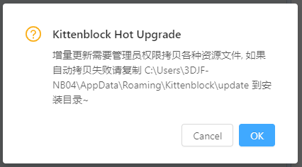
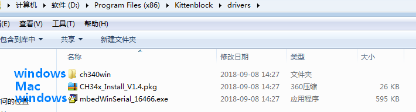

# Kittenblock安裝

KittenBlock是KittenBot的自家編程平台。

## Kittenblock下載

### 下載地址

Windows 10系統：

到瀏覽器前往  [http://www.kittenbot.hk/software/platform/](http://www.kittenbot.hk/software/編程平台/) ‎，按系統點選相應的Download鍵, 下載KittenBlock。

Windows 10以下或MacOS用戶：

到瀏覽器前往  [http://www.kittenbot.hk/software/platform/](http://www.kittenbot.hk/software/編程平台/) ‎，按系統點選相應的Download鍵, 下載KittenBlock。

  

點選下載

 

### 雙擊安裝

下載後雙擊圖示安裝。

  

假如安裝時有防毒軟件，或者系統提示不安全，請安心允許安裝。

選擇安裝目錄，必須選擇英文名字目錄，否則可能會出錯。

### 安裝完成

打開應用程式

## 安裝應用程式後，還要安裝驅動

點擊右上角的小齒輪。安裝Microbit COM和CH340。

安裝過程大約需要數分鐘。

## Kittenblock軟件更新

由於Kittenbot一直開發此軟件為用戶提供新的功能，大家需要不定時更新Kittenblock。

當有更新發佈的時候，Kittenblock會顯示更新提示。

此時你就可以按右上角的火箭圖示更新。

下載完成後按下OK，Kittenblock會自動重啟。

## 軟件排錯：

### 1. KittenBlock打開時白屏或藍屏？

這是因為管理員權限不夠。

### 解決方法，右鍵Kittenblock圖示點擊屬性，更改兼容性和權限。

### 2. 安裝驅動程式時沒有反應？

有可能你的電腦權限要求太高，限制了軟件的操作。

### 解決方法：

打開軟件的目錄：

例如我的軟件安裝在D磁碟上，我就前往 D:\Program Files (x86)\Kittenblock\drivers

手動雙擊安裝：

### 3. 為什麼下載更新後按OK但是沒有反應？

這是因為管理員權限不夠。

### 解決方法：

以管理員身份開啓Kittenblock再進行更新。

