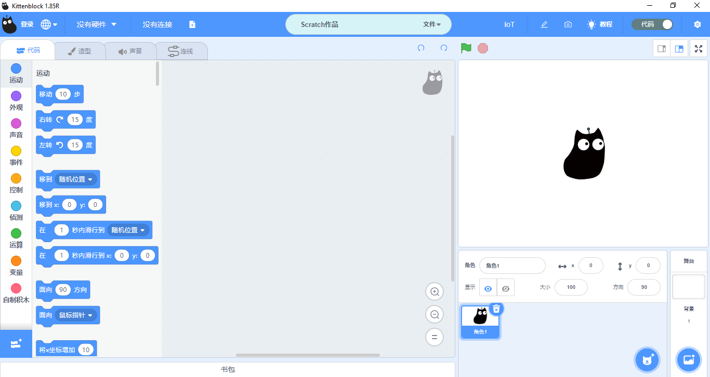
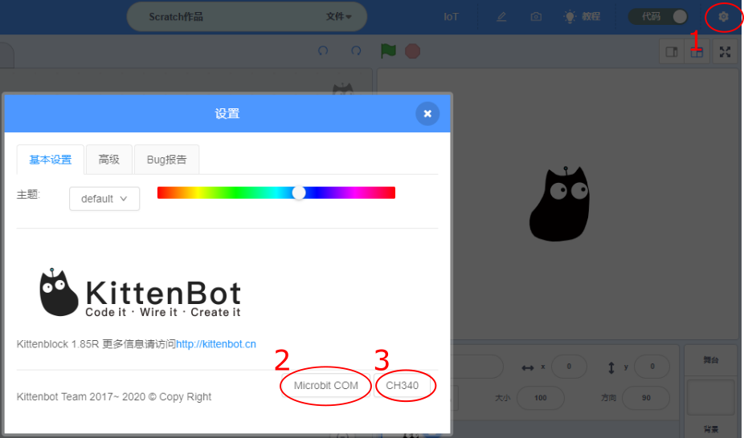

# KittenBlock快速開始

KittenBlock是KittenBot的自家編程平台。

## Kittenblock下載

### 下載地址

到瀏覽器前往 https://bit.ly/KittenblcokdownloadHK ，點選Download下載KittenBlock。

選擇安裝檔案。

### 雙擊安裝

下載後雙擊圖示安裝

假如安裝時有防毒軟件，或者系統提示不安全，請安心允許安裝。

選擇安裝目錄，請盡量選擇英文名字目錄，否則可能會出錯。

### 安裝完成

打開應用程式

## 安裝應用程式後，還要安裝驅動

點擊右上角的小齒輪。安裝Microbit COM和CH340。

安裝過程大約需要數分鐘。

    MacOS只需安裝CH340。
    
## 加載PowerBrick插件

離線版與在線版同樣操作。

在左上角小貓logo旁邊的硬件欄選擇PowerBrick，加載Microbit與Powerbrick插件。

    
## FAQ

1問：我應該如何選擇離線版或在線版呢？

1答：如果你的網速快而穩，推薦使用在線版本。假如你是機構或者用家太多，或網絡不太暢順，推薦使用離線版。

2問：在線版的功能比離線版強大得多嗎？

2答：大家功能是一致的。

3問：在線版支援平板電腦嗎？

3答：Klink的平板版本(Android或iPadOS)還未完成。

## 軟件排錯：

### KittenBlock打開時白屏或藍屏？

這是因為管理員權限不夠。

解決方法，右鍵Kittenblock圖示點擊屬性，更改兼容性和權限。

### 安裝驅動程式時沒有反應？

有可能你的電腦權限要求太高，限制了軟件的操作。

解決方法：

打開軟件的目錄：

例如我的軟件安裝在D磁碟上，我就前往 D:\Program Files (x86)\Kittenblock\drivers

手動雙擊安裝：

或者以管理員身份開啓。

