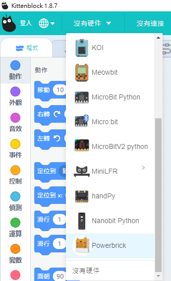
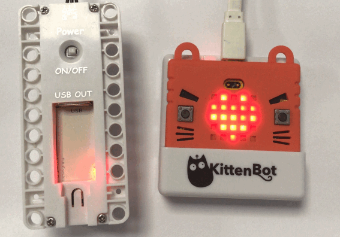
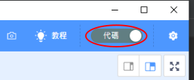
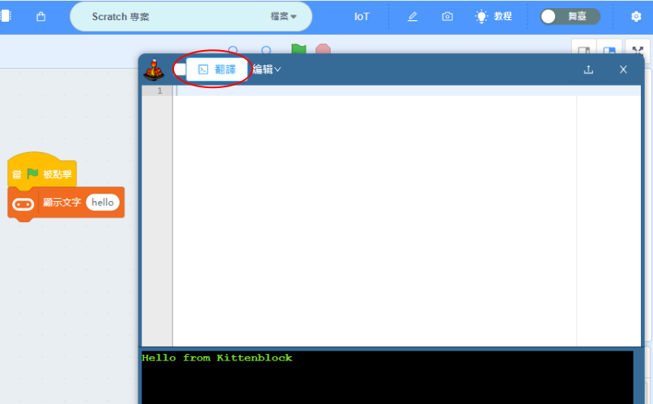
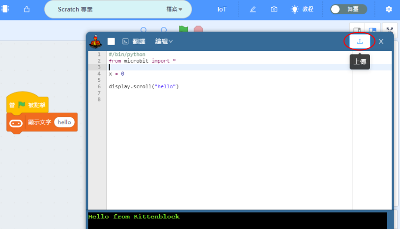

# 在Kittenblock連接Micro:bit

我們要在Kittenblock上使用Microbit，就首先要與Microbit建立連接。

首先將Microbit用USB線連接到電腦。

在左上角小貓logo旁邊的硬件欄選擇硬件，加載Microbit與硬件的插件。

    這教程使用Powerbrick作例子，請大家按照自己手上的硬件作選擇。

Microbit V1請選擇Powerbrick，Microbit V2可以選擇Microbit v2 python。

在Microbit的積木欄中按下感嘆號 ( ! ) 按鈕。

然後點選『開始連線』。

連接完成！

成功連接後，MicroBit會顯示心形。

假如沒有顯示心形，可以按下恢復固件。

## 連接測試

按下Microbit的積木，Microbit應該會即時有反應。

## 上載程式

在Kittenblock平台上也可以將程式上載到MicroBit，不用永遠連着電腦使用。

首先按右上角的代碼按鈕，切換至代碼模式。

然後按下翻譯，將積木轉換成Python代碼。

最後按下上傳，程式就會下載到Microbit上，實現離線操作。

## FAQ

1：為什麼我點擊積木塊沒有反應呢？

首先確保已經連接好Microbit，然後恢復固件再試一試。