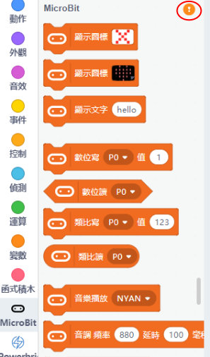

# 在Kittenblock連接Micro:bit

我們要在Kittenblock上使用Microbit，就首先要與Microbit建立連接。

### Kittenblock支援USB連接或藍芽連接，請根據您使用的方式參考連接方法。

### 注意：藍芽連接並不支援下載程式到Microbit！

### 注意：藍芽連接並不支援下載程式到Microbit！

## 使用USB線連接

首先將Microbit用USB線連接到電腦。

在左上角小貓logo旁邊的硬件欄選擇硬件，加載Microbit與硬件的插件。

    這教程使用Powerbrick作例子，請大家按照自己手上的硬件作選擇。

以USB模式連接時請選擇『serial』。

在Microbit的積木欄中按下感嘆號 ( ! ) 按鈕。

然後點選『開始連線』。

連接完成！

成功連接後，MicroBit會顯示心形。

假如沒有顯示心形，可以按下升級韌體。

## 使用藍芽連接

首先將KittenBot藍牙適配器插入電腦或者打開電腦的藍芽模式。

    藍芽適配器初次使用前需要更新固件，詳情請參考此教程：

將Microbit用USB線連接到電腦。

按下右上角的設定，然後按下『進階』(Advanced)，剔選USB BLE選項。

    這一步很重要，請勿忘記！

在左上角小貓logo旁邊的硬件欄選擇硬件，加載Microbit與硬件的插件。

    這教程使用Powerbrick作例子，請大家按照自己手上的硬件作選擇。

以藍芽模式連接時請選擇『ble』。

在Microbit的積木欄中按下感嘆號 ( ! ) 按鈕。

然後點選『開始連線』。

連接完成之後按回到編輯器。

然後按下『升級固件』(Upgrade Firmware)。

完成後Microbit上會顯示一串英文字母，這是Microbit自己的ID。

然後可以斷開與Microbit的連接，再重新連接硬件。

選擇自己Microbit的藍芽ID進行連接。

連接完成！

成功連接後，MicroBit會顯示心形。

假如沒有顯示心形，可以按下升級韌體。

## 連接測試

按下Microbit的積木，Microbit應該會即時有反應。

## 上載程式

#### 在Kittenblock平台上也可以將程式上載到MicroBit，不用永遠連着電腦使用。

首先按右上角的代碼按鈕，切換至代碼模式。

然後按下翻譯，將積木轉換成Python代碼。

最後按下上傳，程式就會下載到Microbit上，實現離線操作。

## FAQ

1：為什麼我點擊積木塊沒有反應呢？

首先確保已經連接好Microbit，然後上載韌體再試一試。

2：為什麼在藍芽模式下搜索不到Microbit？

請確保您已經更新藍芽適配器的固件和上傳韌體至Microbit。