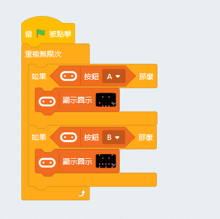
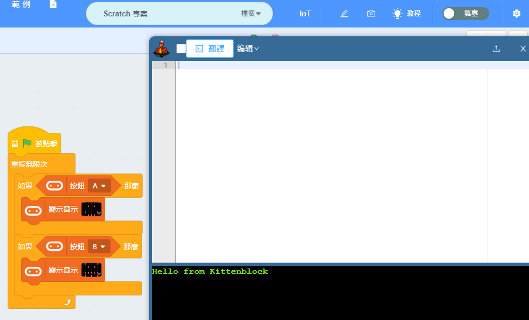
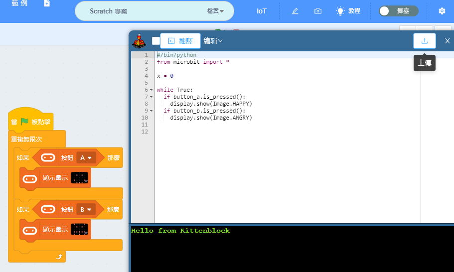
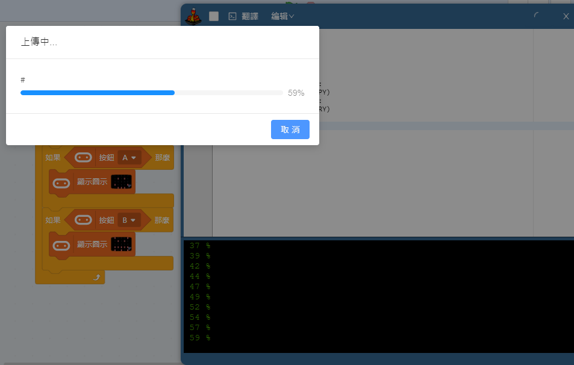
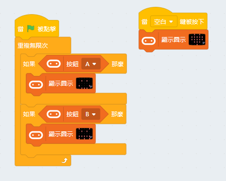
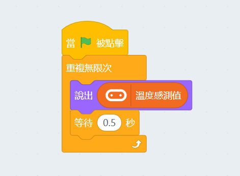
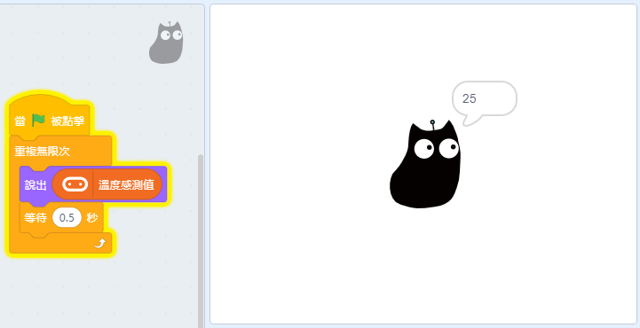
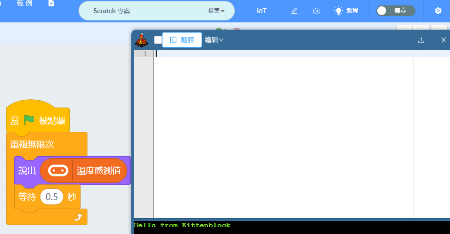
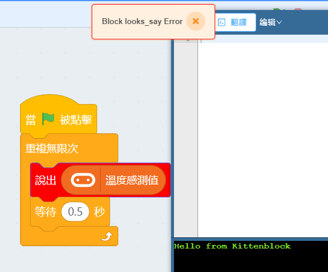
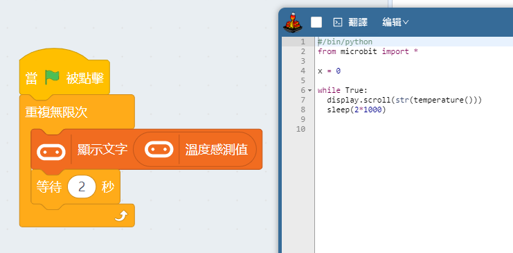

# 在Kittenblock使用Micro:bit

連接Microbit之後我們就可以開始進行編程。

## Kittenblock的編程模式

Kittenblock支援兩種編程模式：

### 1. 在線實時模式

這模式的獨特之處在於Microbit的程序可以與舞台實時同步。

何謂與舞台同步？那即是Microbit與舞台可以互相控制對方。
這代表舞台和硬件的積木塊都能用，你可以用Microbit控制舞台上的角色，而且反之亦然。
    
### 2. 離線下載模式

Kittenblock也支援像Makecode那樣將程序上載到Microbit，程序保留在Microbit上就可以離線運行，不需要永遠連著電腦使用。

要上載到Microbit的話就不可以使用舞台的積木塊，而且也不能與舞台做到同步了。

有關舞台積木與硬件積木的解釋可以參考： asdsdgsdfgsfhdsdhgj

## 編程範例1：控制點陣屏

#### 請將Microbit以USB線連接到Kittenblock。

#### 在線實時模式

我們首先編寫一個簡單程序，利用空白鍵與舞台角色控制Microbit的點陣屏。

完成後點擊舞台上的小貓角色或者按下空白鍵，您可以看到Microbit上的點陣屏會即時顯示相應圖案。

這就是以舞台實時控制Microbit的例子了。

#### 離線下載模式

然後我們試試編寫一個離線運行的版本。

然後切換到代碼模式，按下翻譯按鈕。

你的積木會自動變成代碼，最後按下上載。

上載完成之後你可以按Microbit的A和B鍵，點陣屏就會顯示相應圖案了。

然後我們再試試加上積木，編寫按空白鍵控制點陣屏的程式。

但是這時候我們按下空白鍵的時候，Microbit並不會有反應。這是因為我們正在離線運行Microbit，Kittenblock與Microbit沒有溝通。

這就是連線運行與在線實時的分別了。

## 編程範例2：溫度探測

#### 請將Microbit以USB線連接到Kittenblock。

#### 在線實時模式

我們來試試編寫一個簡單的程式，讓小貓角色說出Microbit探測到的溫度。

完成之後點擊小綠旗，小貓的角色就會說出microbit探測到的溫度。

這就是實現了microbit控制舞台的效果。

#### 離線下載模式

然後我們試試切換至代碼模式並將以上積木翻譯成代碼。

大家可以看見翻譯會失敗，並會有警告，將錯誤積木變成紅色。這是因為讓小貓說話的積木是舞台限定的，Microbit不能運行，所以翻譯失敗。

從這件事我們可以知道，假如想上載程式到Microbit，我們就不可以使用只限舞台的積木。

舞台積木與硬件積木的解釋可以參考：[編程積木欄](./interfaceIntro/codingblocks.md)

我們只要改一改錯誤的積木，然後再翻譯。

翻譯成功！此時我們就可以上載程式到Microbit了。

## 總結

#### Kittenblock中可以支援2種模式：

1. 與舞台實時互動
   
- 將Kittenblock與Microbit連接起來，可以實現舞台與Microbit的互動。
- 舞台和硬件的積木都可以使用。
    
2. 離線運行

- 可以將程式儲存在Microbit上，切斷連接也可以運行。
- 只能夠使用硬件的積木，不可以使用舞台限定的積木。