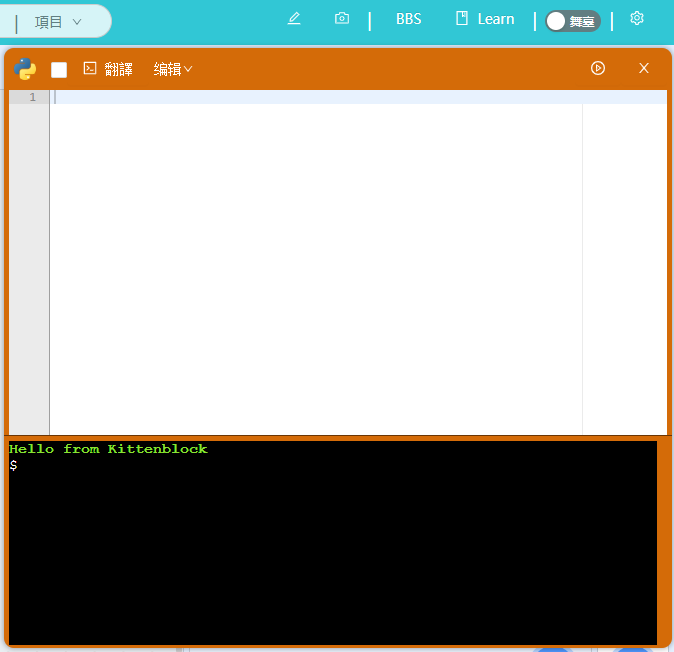
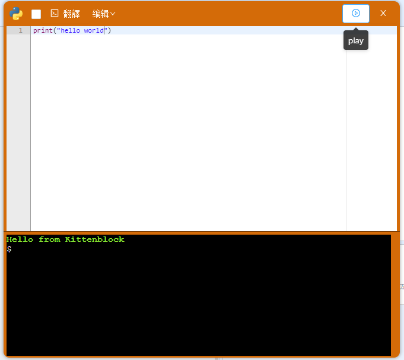
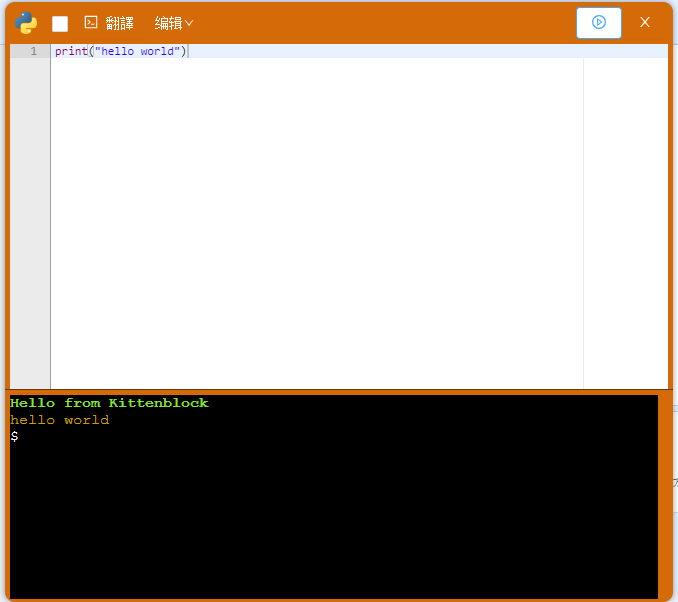
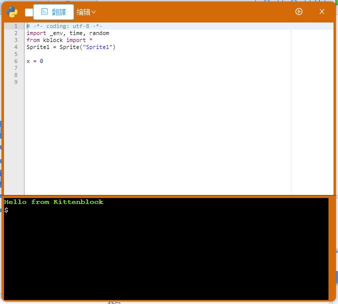
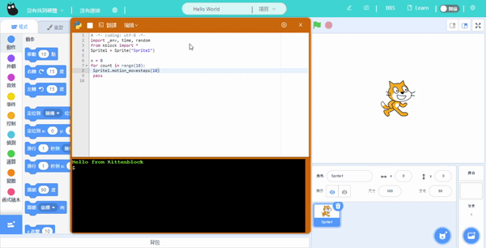

# 在Kittenblock學習Python 3

在Kittenblock中預載了Python 3語言的編輯器，而Kittenblock中的積木背後其實都是Python代碼。

一般使用時不會涉獵到Python代碼編程，不過如果大家有興趣學習Python的話不妨試試這個編輯器。

## 使用Python編輯器

有關Python編輯器的介面介紹可以參考： [參考](../kittenbot_function/kittenpython.md)

按右上角的舞台切換按鈕，切換到編程模式。

然後我們就可以開始編程了。

完成之後我們就可以按下運行，運行結果會顯示在編輯器的下半部份。

## Python與舞台

在Kittenblock中學Python，有一個很大的好處，就是可以與舞台互動。一般學習編程，編程的結果都是以文字方式在主控台中顯示，在這裡我們可以與舞台互動，編程結果能夠以圖像化的方式呈現在大家眼前。

在編程的世界裡面，我們很多時都要先載入不同的插件(library)，在Kittenblock也是一樣，我們要先載入與舞台互動的插件。

載入方法很簡單，只要按一下翻譯，編輯器就會自動寫入編碼載入插件。

在Kittenblock中學Python的另一個好處就是可以拖曳積木。平常我們學習編程會花很多時間牢記住語法，而且很多時候會打錯語法，最後要花上很多時間排錯。在Kittenblock中我們不會遇到這些麻煩，只要將積木拖曳到編輯器，他就會自動變成Python編碼了。

最後按下運行。

