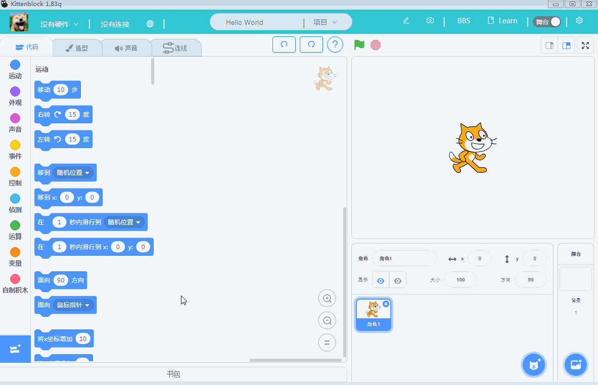
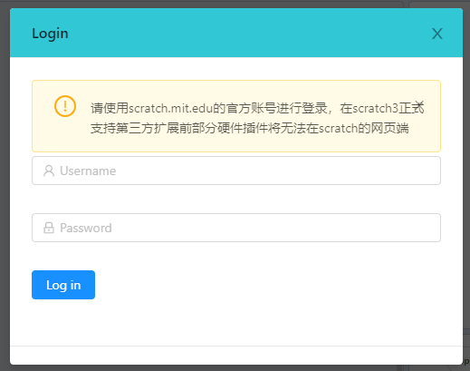
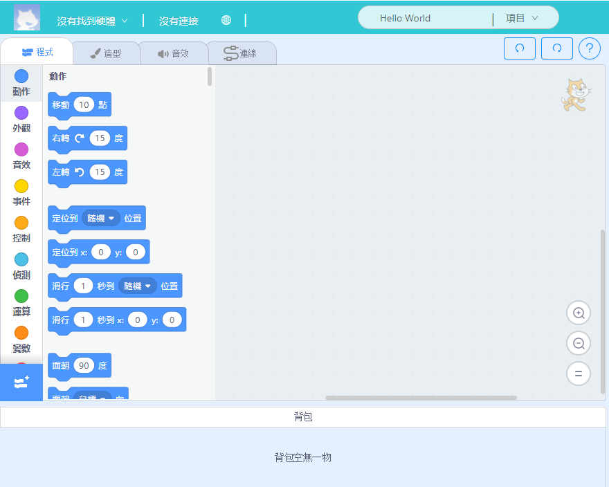
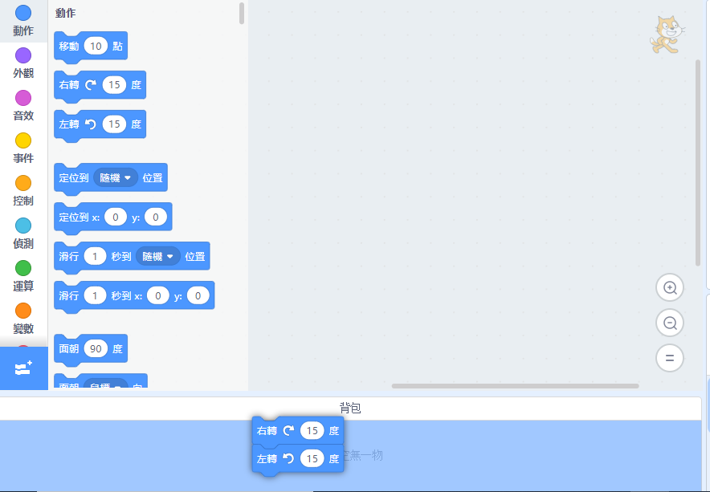
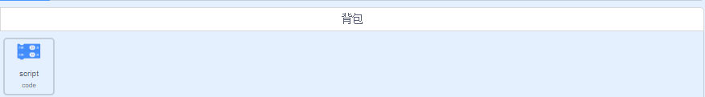
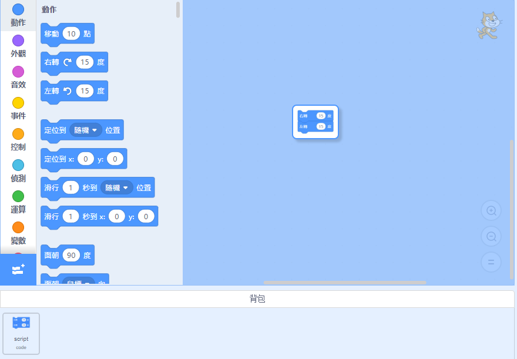
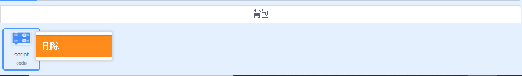

# 書包功能(只限1.84z)

在Scratch 3.0之中，MIT新增了一個書包的功能。Kittenbot特地在Kittenblock 1.84z中與Scratch同步，一併加入書包功能。

## 書包功能簡介

顧名思義，這是你的書包，您可以放入或取出東西。而在Scratch裡面，這個書包就是可以放入和取出程式。

我們平常編程的時候，總是有一些程序是經常重複使用的。由於我們不可以將積木複製然後貼上到另一個專案上，MIT就推出了這個功能。

將常用的程序放進書包中，以後在其他專案只要打開書包你就可以使用這些程序了，確實是可以為我們節省了很多功夫和時間。

## 使用書包

由於書包是MIT Scratch的功能，我們需要登入MIT Scratch帳號才可以使用。

需要註冊MIT帳號的可以前往：[MIT Scratch](www.google.com)

登入之後就可以使用自己專屬的書包了~

按下書包就可以打開書包的拉鏈。

我們的書包是新的，所以裡面空無一物。

我們來試試將程序積木拖曳到書包裏。

完成！以後這段程序就會儲存在我們書包裏。

我們可以將書包中的程序拖出來使用。

我們亦可以對書包中的程序按右鍵，將程序刪除掉。

