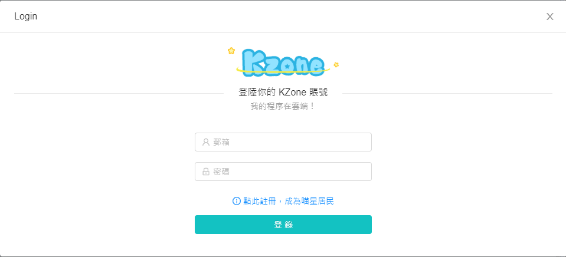

# 書包功能

Kittenbot為了方便用戶放入和取出程式，在Kittenblock加入了與Scratch相似的書包功能。

## 書包功能簡介

顧名思義，這是你的書包，您可以放入或取出東西。而在Scratch裡面，這個書包就是可以放入和取出程式。

我們平常編程的時候，總是有一些程序是經常重複使用的。由於我們不可以將積木複製然後貼上到另一個專案上，Kittenbot就推出了這個功能。

將常用的程序放進書包中，以後在其他專案只要打開書包你就可以使用這些程序了，確實是可以為我們節省了很多功夫和時間。

## 使用書包

需要登入K Zone帳號才可以使用。

需要註冊K Zone帳號的可以前往：[K Zone](https://zone.kittenbot.cn/user/register)

登入之後就可以使用書包了。

按下書包就可以打開書包。

將程序積木拖曳到書包裏。

以後這段程序就會儲存在書包裏。

可以將書包中的程序拖出來使用。

亦可以對書包中的程序按右鍵，將程序刪除掉。

