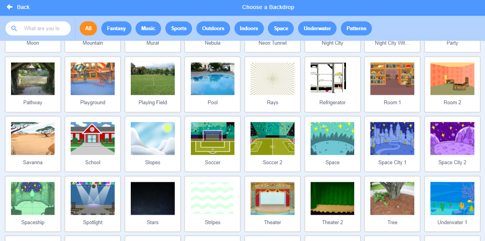

# 角色與背景編輯

在介面介紹中和大家講過一下可以編輯舞台的角色和背景，在這教程我們我詳細看一下操作。

## 角色編輯

### 1. 角色參數

我們可以在這裡編輯目前角色的參數，例如名稱、位置、大小、角度和隱藏角色。

### 2. 角色選擇

我們可以在這裡選擇角色。

### 3. 增加角色

我們可以在這裡增加角色。將滑鼠移到按鈕上，就會顯示選項菜單。

#### 3.1 選擇角色

我們可以從預設角色中選擇。

#### 3.2 繪畫

我們可以繪畫一個新角色。

#### 3.3 驚喜

我們可以從隨機抽到一個角色。

#### 3.4 上傳角色

我們可以上傳圖片建立新角色。

## 背景編輯

### 1. 背景選擇

我們可以在這裡選擇背景。

### 2. 增加背景

我們可以在這裡增加背景。將滑鼠移到按鈕上，就會顯示選項菜單。

#### 2.1 選擇背景

我們可以從預設背景中選擇。

#### 2.2 繪畫

我們可以繪畫一個新背景。

#### 2.3 驚喜

我們可以從隨機抽到一個背景。

#### 2.4 上傳背景

我們可以上傳圖片建立新背景。

