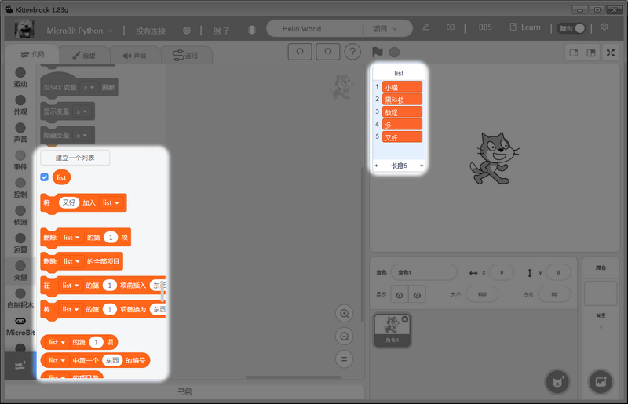
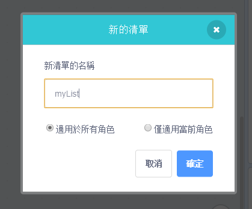
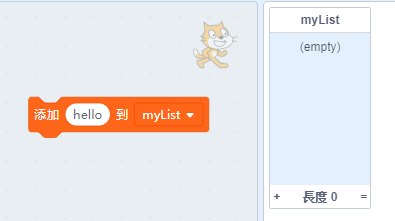
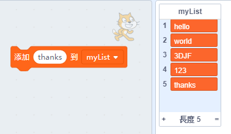
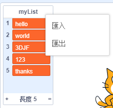
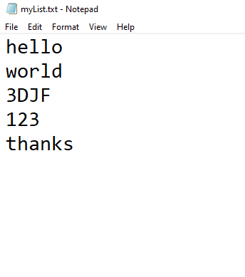
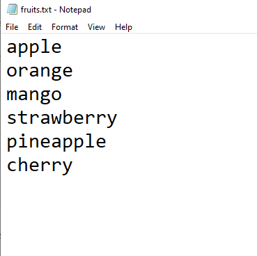
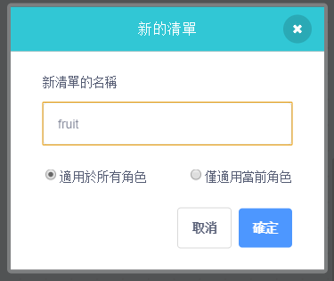
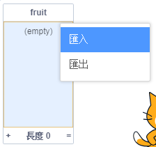
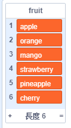

# 清單匯入匯出功能

在Scratch 3.0之中，MIT新增了一個清單匯入匯出功能。Kittenbot特地在Kittenblock 1.84z中與Scratch同步，一併加入清單匯入匯出功能。

## 清單匯入匯出功能簡介

在Scratch裡面，我們可以建立清單儲存不同項目，功能就和大家熟悉的序列(Array)一樣。

這個功能可以讓我們將清單內容輸出為一個txt檔案，亦可以將txt檔案的內容輸入變為一個清單。

## 使用清單匯入匯出功能

我們首先來試試將清單內容匯出的功能。

首先，請建立一個清單。

我們試試將文字加入到清單中。

然後對著舞台上的清單右擊，選擇匯出。

之後打開匯出的txt檔案，可以看到清單內容會儲存在檔案入面。

然後我們來試試將txt檔案匯入到清單。

建立一個txt檔案，然後輸入內容。每一個內容需要以一行分隔。

然後在Scratch中建立新的清單。

然後對著這個清單右擊，選擇匯入。

匯入成功，內容自動輸入到清單裏。

