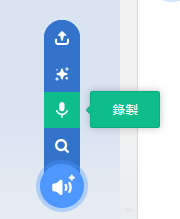

# 音效編輯

我們也可以在Scratch中編輯音效。

編輯音效的欄位可以在這裡找到。

### 1. 音效選擇

我們可以在這裡選擇音效。

### 2. 修改音效

我們可以在這裡修改音效。例如修改名稱、音量、修剪、和不同效果。

### 3. 增加音效

我們可以在這裡增加音效。

將滑鼠移到按鈕上，就會顯示選項菜單。

#### 選擇音效

我們可以在這裡選擇音效。

#### 錄製音效

我們可以在這裡錄製音效。

#### 驚喜

我們可以從隨機抽到一個音效。

#### 上傳音效

我們可以上傳音效。

