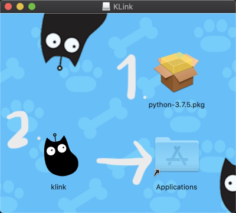
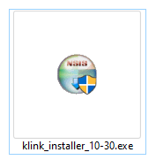
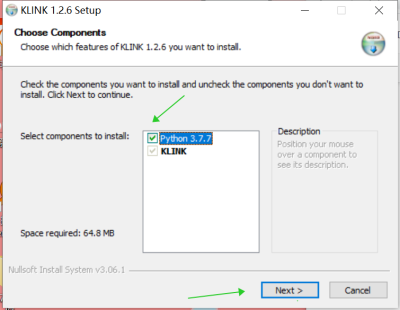
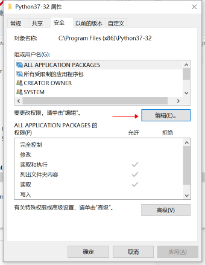
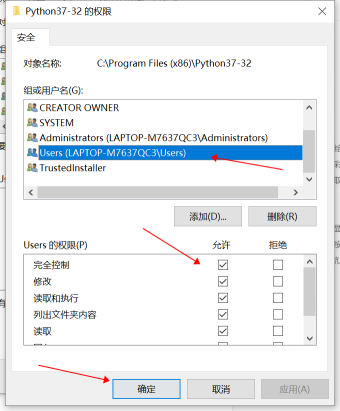

# KittenCode安裝

KittenCode是KittenBot自家開發的Python編程平台。

## KittenCode下載

### 下載地址

Windows 10系統：

前往 [http://www.kittenbot.hk](http://www.kittenbot.hk/software/platform/) ，按系統點選相應的Download鍵‎，下載KittenCode。

MacOS用戶：

到瀏覽器前往 [http://www.kittenbot.hk](http://www.kittenbot.hk/software/platform/) ，按系統點選相應的Download鍵，下載KittenCode。

### 雙擊安裝

下載後雙擊圖示安裝。

Windows 10系統：

    注意，建議剔選安裝Python3.7.7。

MacOS用戶：

## 疑難排解

### Windows可能會遇到權限問題，請按照下圖修復。

1. 前往C:\Program Files (x86)\Python37-32。
2. 右鍵->屬性->安全->編輯
3. 點選用戶，剔選完全控制然後按確認

