# KittenCode操作指引

## 主介面

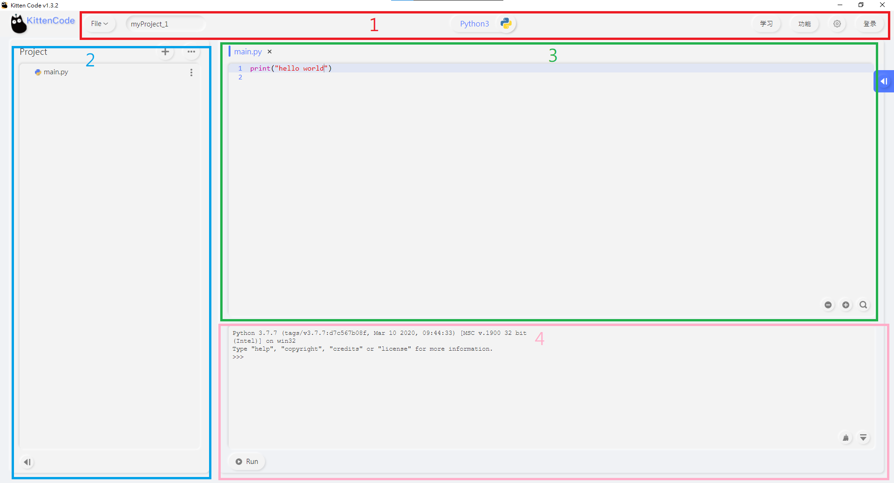

1. 功能區：專案命名與儲存，模式切換，選項等
2. 文件區：專案內的文件，硬件文件系統
3. 編程區：編寫程式
4. 執行區：運行程式，上傳程式(硬件模式)，顯示程式的列印，負責執行REPL模式(硬件模式)

## 功能區

1. 檔案區：命名檔案，儲存檔案，打開檔案等
2. 切換模式：切換Python與MicroPython硬件模式
3. 功能欄：Python庫管理，設定

### Python庫管理

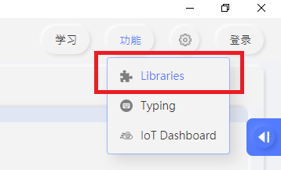

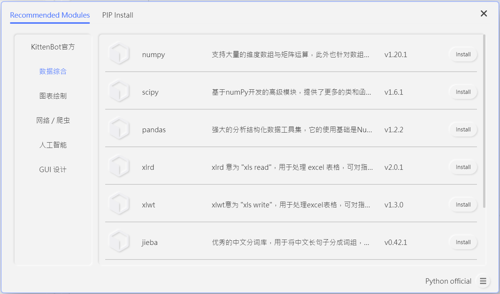

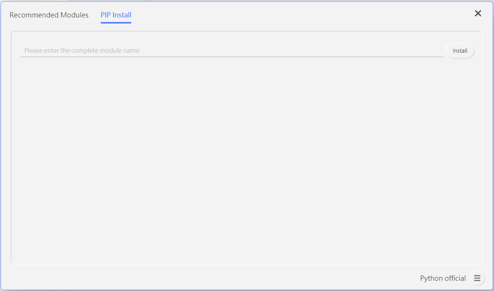

1. 安裝Python庫
2. 選擇安裝源

### 硬件模式

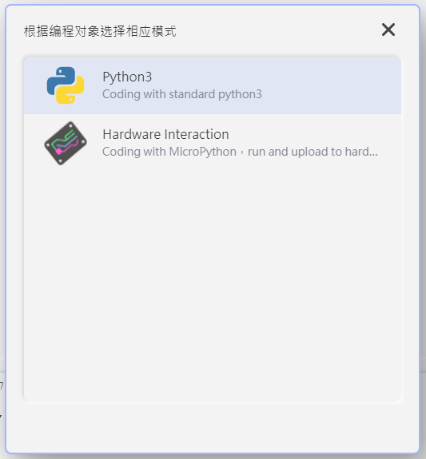

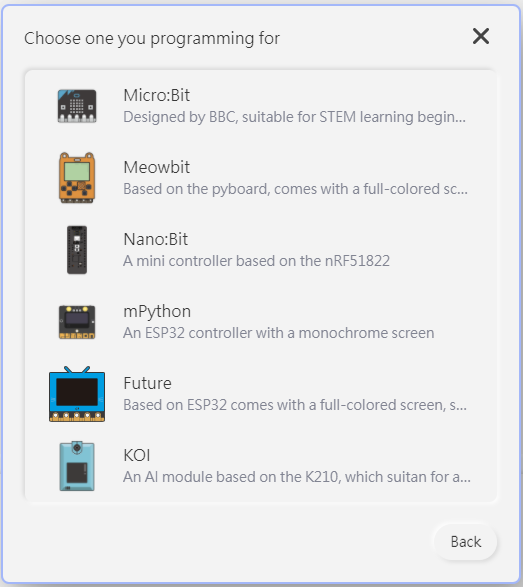

選擇硬件

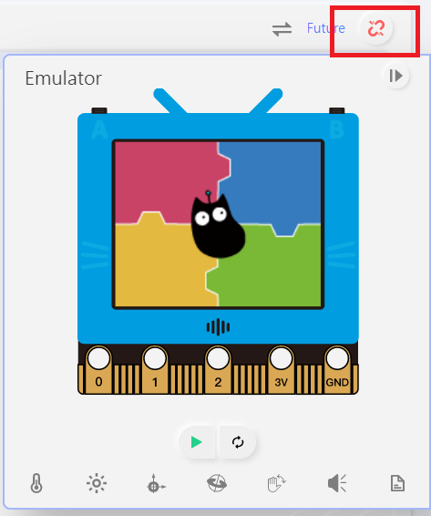

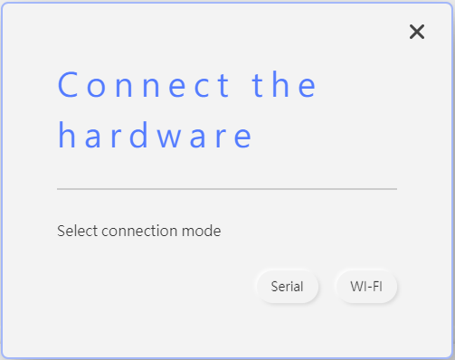

連接硬件，切換硬件

## 文件區

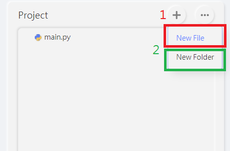

1. 建立新文件，建立新資料夾
2. 選擇檔案

## 編程區

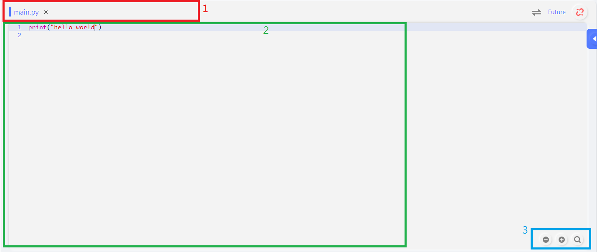

1. 選擇檔案
2. 編程區
3. 縮放與搜尋

## 執行區

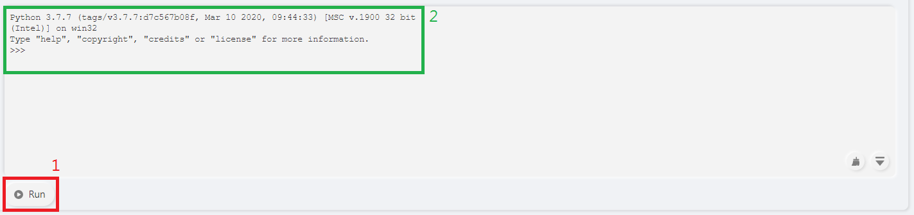

1. 運行程式

2. 顯示程式的列印，REPL模式輸入，清空控制台資訊