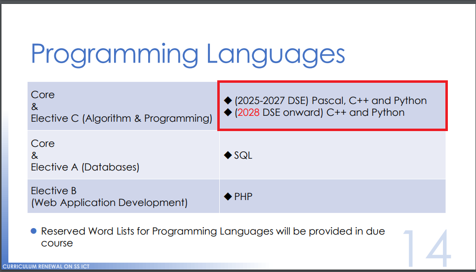

# KittenCode介紹

KittenCode是由KittenBot研發推出的一款Python編程平台。KittenCode支援純Python3的編程之餘亦支持第三方庫的安裝和使用；KittenCode疫支援使用Micropython進行硬件編程，可直接對Micro:bit、KOI和Meowbit等硬件編程，實現在線運行及上傳程式離線運行。

Python編程在STEM編程教育的重要性越來越大，香港教育局已經定下指引，在2025年開始在香港中學文憑考試(HKDSE)裏將Python定為指定的考核語言。Python的語法相比起其他語言來說更加簡便易明，比較容易學習。Python更是人工智能和機器學習等範疇中被廣泛應用的語言。所以說現在確實是學習Python的大好時機！

## 下載KittenCode

[下載KittenCode](https://bit.ly/kittencodeDL)

## 功能和特點

- 支援Python REPL編程
    - REPL即是交互式編譯器，就是你可以在控制台輸入一行行的代碼，它就會即時運行。
    
- 支援MicroPython對硬件編程
    - 可以對Micro:bit、KOI和未來板、Meowbit等的MicroPython硬件編程
    - 可以實現連線實時互動，亦可以上傳程式實現離線運行
    
- 支援下載第三方庫
    - 可以實現pip install的功能，下載第三方的Python庫
    - 下載第三方Python庫，輕易學習AI，Machine Learning等的新技術
    
- 介面簡潔易明