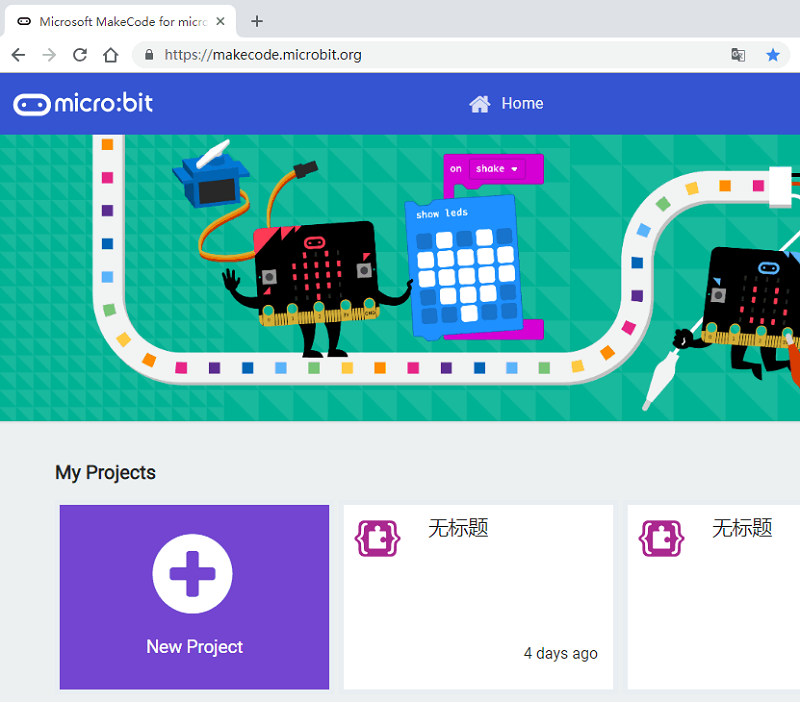
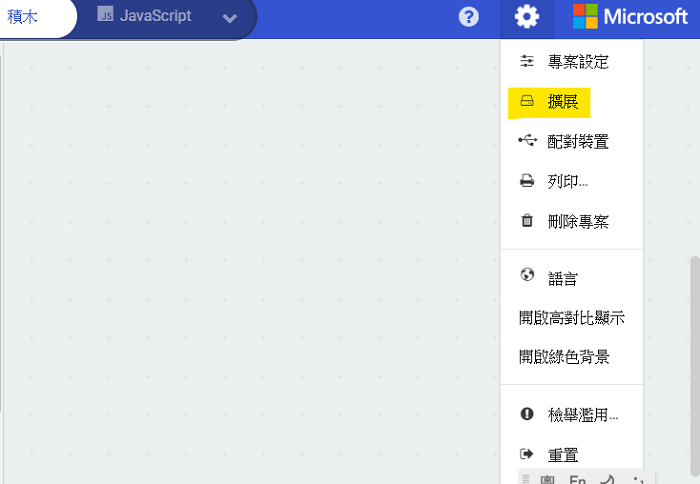
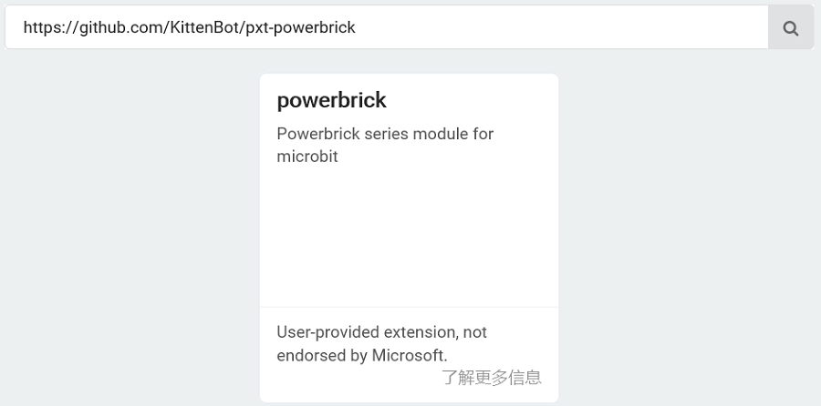

# KittenBot產品與MakeCode

## 快速開始

KittenBot產品首推的編程平台是微軟Makecode。

MakeCode: 

[https://makecode.microbit.org/]()

## KittenBot產品在MakeCode上編程

首先進入MakeCode，建立新專案。

### 加載插件

編程之前我們需要先載入KittenBot產品的插件。

#### 在此教程我們會使用Powerbrick作為例子，學習加載Powerbrick的插件。

    KittenBot不同產品需要不同的插件，插件資料可以在各產品的教程中找到。

複製以下地址，在搜尋欄貼上並搜尋。

### https://github.com/KittenBot/pxt-powerbrick

點擊加載，加載成功後會新增PowerBrick的積木塊。

