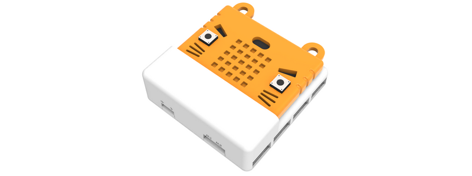
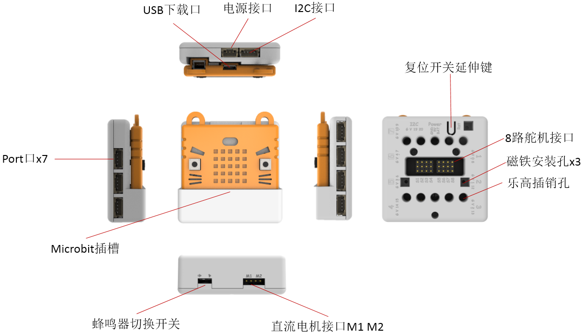
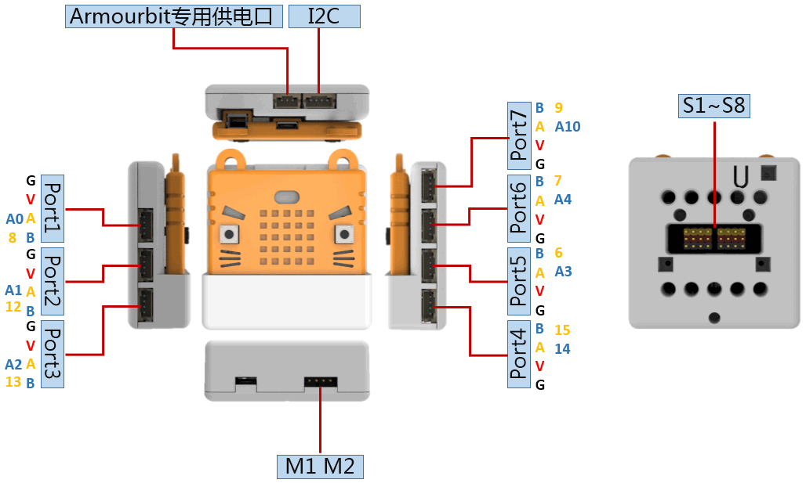
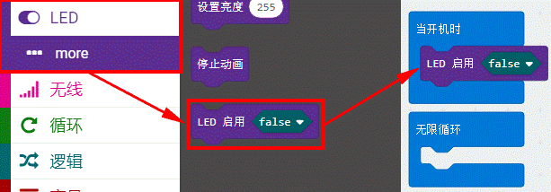
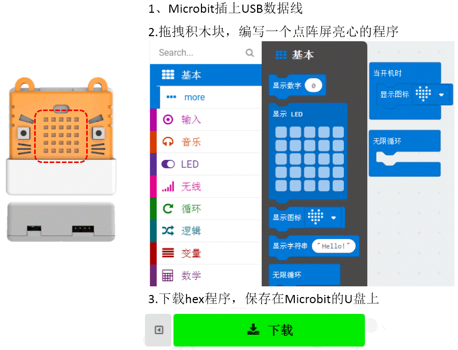
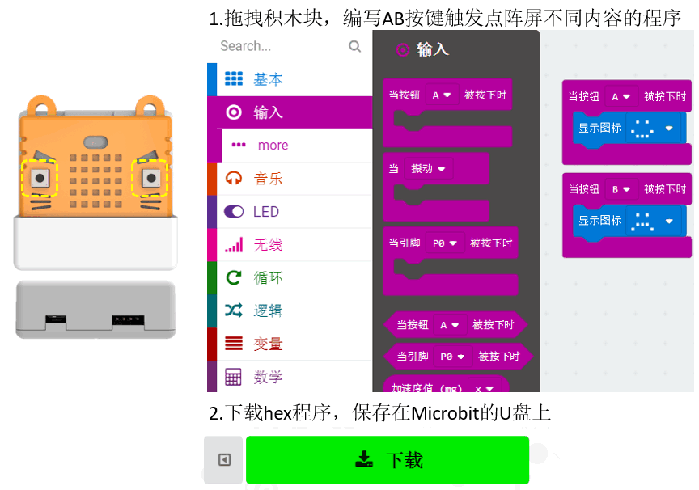
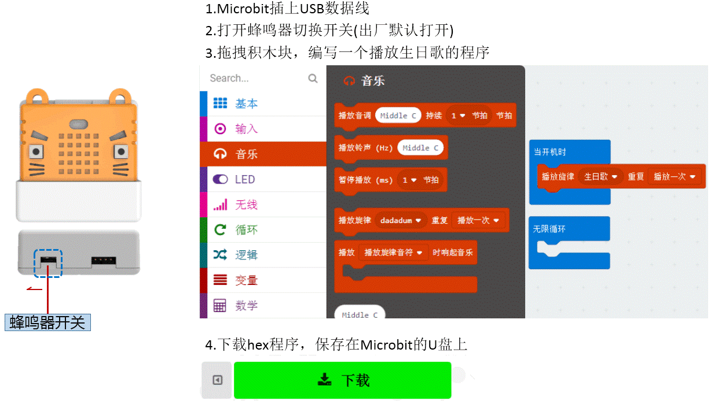
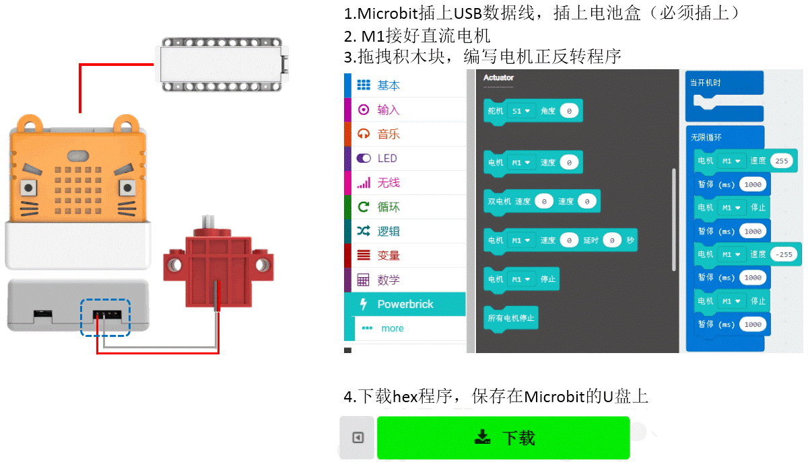
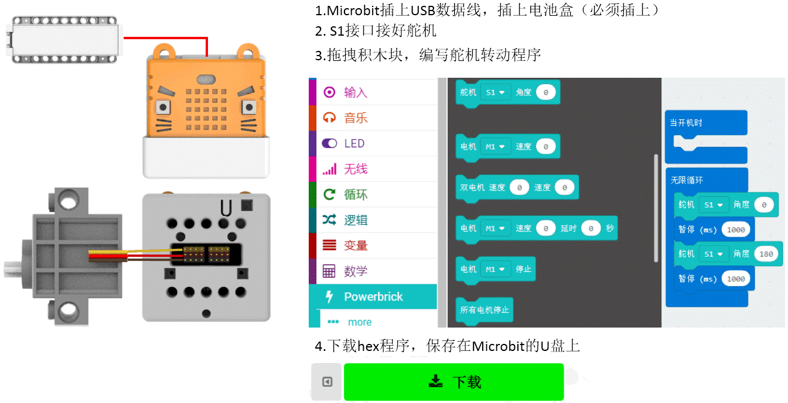

# Armourbit

跟Robotbit 性質類似, Armourbit 也是 Microbit的一款擴展配件，由於它外形像個盒子, 就稱它為Microbit 擴展盒。

Armourbit 是Powerbrick (能量魔塊) 套件體系的主控盒，打通Microbit與套件中各種Brick (魔塊)的連接。它具有以下特色:

1. 7個Port 位，1個I2C介面
2. 採用4PIN防反接端子口
3. 自帶蜂鳴器，兩路電機驅動
4. 八路舵機驅動
5. 對電路板進行全包裹，全方位保護更安全，適合編程教育的使用場景。

Armour中文意思是指盔甲（Armour讀法arm 麼），Kittenbot 開發人員希望這個擴展盒能給予Microbit擴展之餘, 還有全方位的保護，更適合課堂的使用環境。

## 詳細介紹

## 規格

- 電壓：3.3V（板載不帶5V電壓）
- 尺寸：61mm X 61mm X 23mm
- 介面：PH2.0 4PIN端子 ，引腳服從GVAB排布
- 直流電機介面：電壓不超過5V，電流小於1A，適用於喵家黃色TT電機或者Geekservo電機
- 舵機介面：電壓3.7~6V，單路電流小於100MA，總電流小於1A，適用9g藍色小舵機或喵家Geekservo

對應Makecode程式設計介面：

Makecode Online：https://makecode.microbit.org/

**Powerbrick 插件 (Extension)**：https://github.com/KittenBot/pxt-powerbrick

## 引腳分布

- 新手用戶無需記住Port位對應的引腳，只需記住port位使用即可。
- 使用**Port5-Port7**口需關閉LED點陣屏功能（如下圖，關閉LED點陣操作）才能進行使用
- Port4口沒有模擬讀取功能（溫濕度的土壤水位魔塊不能使用）（因為Port5-Port7引腳被Microbit點陣屏佔用了）

## 使用注意事項

- 舵機介面只能使用藍色的9g小舵機或Geekservo舵機，禁止插接大電流舵機。
- 直流電機(DC motor)介面只適用於喵家TT電機或Geekservo電機，禁止插接大電流電機。
- 蜂鳴器與Microbit的P0複用，使用時需檢查底部的撥動開關是否打開。（蜂鳴器預設為開啟）
- 使用各個模組、電機、舵機，**必須接Powerbrick電池盒，否則因為電流不足，導致模組使用不正常。**

## Micro:bit安裝到Armourbit上示範

下方左側的撥動開關是用來切換P0是否連接蜂鳴器

## Reset (重啟)Microbit 示範

用於重定Microbit的程式（這樣你就不用把Microbit 拿出來才能進行復位了）

## 编程介绍

### 點陣屏编程

與Microbit操作一樣

### 按鍵編程

與Microbit操作一樣

### **蜂鳴器編程**

與Microbit操作一樣

### DC motor (直流馬逹)编程

注意電機介面M1、M2，程式設計對應進行控制

### 舵機編程

注意舵機線序接法，注意舵機線序介面S1-S8，實物接線與程式程式設計需要對應。

