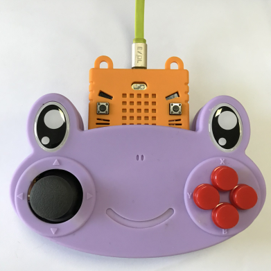

# Kittenbot JoyFrog micro:bit遙控

Kittenbot JoyFrog micro:bit遙控綠色(HKBA8027A)

Kittenbot JoyFrog micro:bit遙控紫色(HKBA8027B)

JoyFrog是Kittenbot推出的Microbit擴展版，它為Microbit增加了按鍵和搖桿等的輸入方式，適合作為遙距控制機械人的遙控器。它還可以用作主控板，在Kittenblock中充當遊戲手掣使用。

## 配送清單

- Joyfrog手掣x1
- Microbit電池盒x1

## 產品特色

